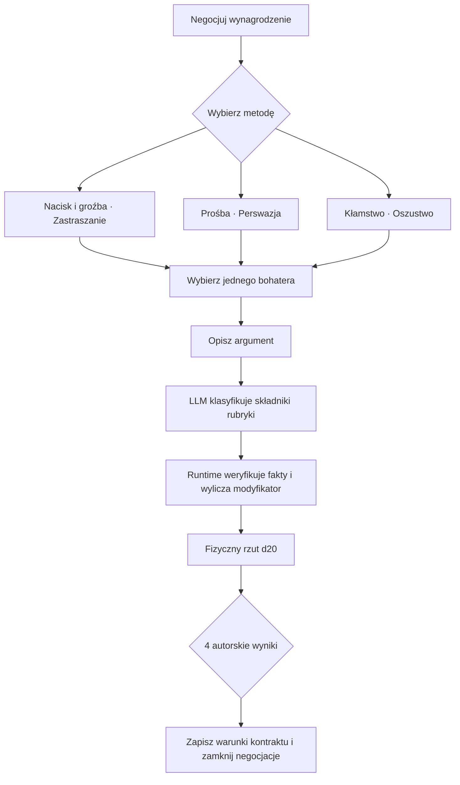
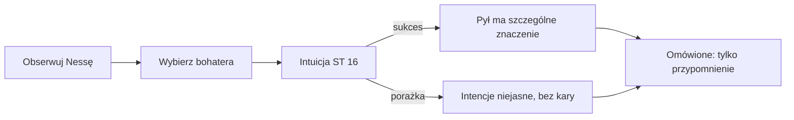
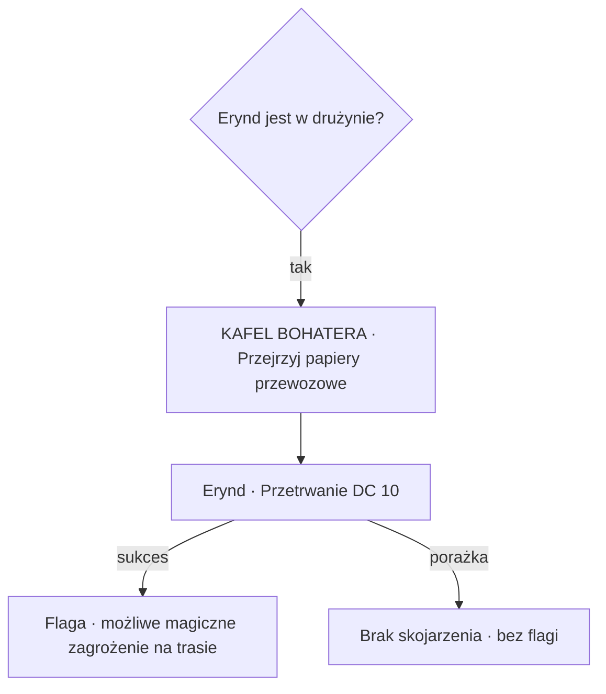
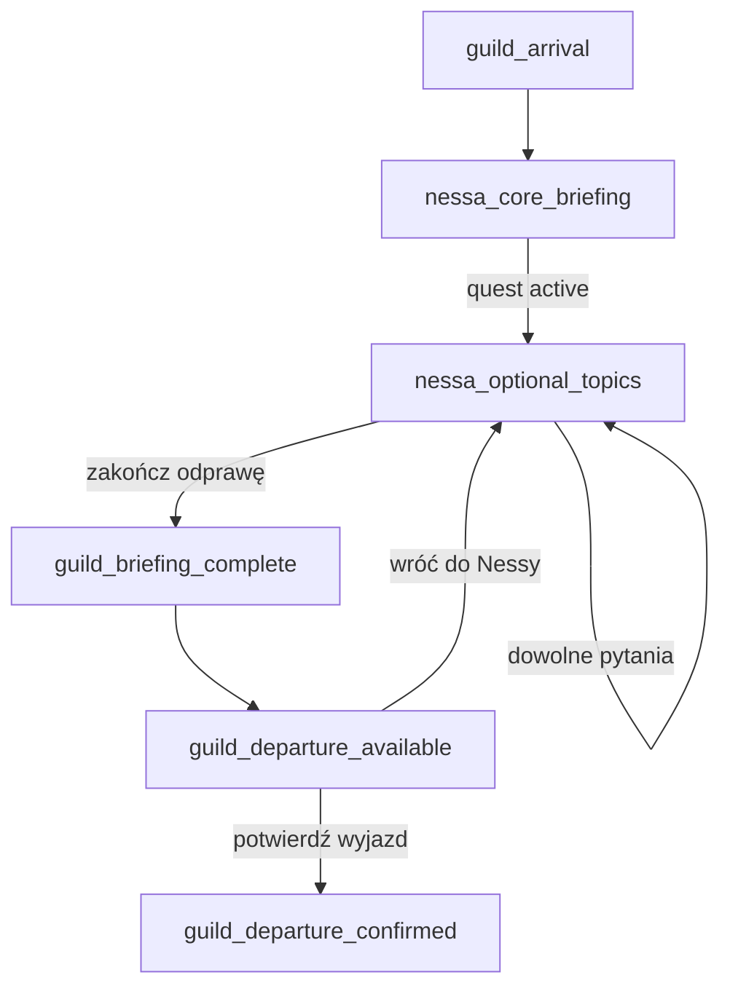

# Mapa 0 — Siedziba Gildii i odprawa Nessy

Status: scena wdrożona; dopracowanie odprawy 2026-09-05
Kampania: `Ostatni transport do Czarnego Brodu`  
Zakres: wejście do Gildii, pierwsza interakcja z Nessą, aktywacja zadania i
odblokowanie wyjazdu na Mapę 1

Ten dokument jest źródłem wykonawczym dla Mapy 0. Uzupełniamy go wraz z dalszymi
decyzjami projektowymi, a dopiero potem przekładamy na pliki scenariusza,
flowgraf, testy runtime, teksty dialogowe i assety. Ogólny przebieg kampanii
pozostaje w [`ostatni_transport_graf.md`](ostatni_transport_graf.md), a kanon
organizacji w
[`GILDIA_SZLAKOW_I_EKSPEDYCJI.md`](GILDIA_SZLAKOW_I_EKSPEDYCJI.md).

Aktualny opis wdrożenia i testów: [`NESSA_BRIEFING_POLISH.md`](../../../docs/NESSA_BRIEFING_POLISH.md).

## 1. Cel doświadczenia

Pierwsza wizyta w Gildii ma:

- osadzić drużynę w świecie po krótkim prologu `TBD`;
- pokazać bazę jako miejsce, do którego będzie można wracać;
- przedstawić Nessę jako przełożoną i zleceniodawczynię;
- przekazać obowiązkowy rdzeń zadania bez długiej ekspozycji;
- nagrodzić graczy, którzy dobrowolnie zbierają szczegóły i robią notatki;
- zakończyć się czytelnym odblokowaniem wyjazdu na Mapę 1.

Docelowe odczucie: krótka, konkretna odprawa z wyczuwalną tajemnicą. Gracze
powinni móc ruszyć dalej po około 3–5 minutach albo zostać dłużej i zdobyć
informacje przydatne później.

## 2. Zakres pierwszej wersji

### Działa w runtime

1. Punkt interakcji `nessa`.
2. Automatyczny rdzeń odprawy przy pierwszym wejściu.
3. Siedem stałych kafelków Nessy; omówione tematy zachowują numer i pole jako podgląd bez ponownego rozstrzygnięcia.
4. Aktywacja zadania bez możliwości odmowy.
5. Zapis poznanych faktów i szczegółów operacyjnych.
6. Kafelek kończący odprawę.
7. Odblokowanie punktu `guild_departure_gate`.
8. Potwierdzane przejście do montażu podróży i Mapy 1.

### Widoczne wyłącznie jako część ilustracji

- Kwatermistrz;
- plac treningowy;
- Archiwum Następstw i Kartografii.

Placeholdery mają własne, stałe pola LED i krótkie komunikaty kontekstowe, ale
nie uruchamiają jeszcze handlu, rozwoju ani systemu Archiwum. Dzięki temu mapa
jest grywalnym interfejsem już teraz, bez udawania gotowych podsystemów.

### Poza obecną specyfikacją

- właściwy tekst prologu;
- pełna osobowość, głos i dialogi Nessy;
- rozwój postaci, wydawanie PD i nauka nowych kart;
- handel, trening, odpoczynek oraz obsługa Archiwum;
- powrót do Gildii po zakończeniu kampanii.

## 3. Mapa i punkty interakcji

Mapa jest ilustracją point-and-click wyświetlaną na planszy 20×30, a nie
taktycznym planem pomieszczeń.

| Id robocze | Nazwa | Stan początkowy | Zachowanie |
|---|---|---|---|
| `nessa` | Nessa / biuro odpraw | aktywne | Pole `(6,5)`; otwiera pełną instancję odprawy. |
| `guild_departure_gate` | Brama wyjazdowa | widoczne, zablokowane | Pole `(10,2)`; przed odprawą pokazuje przyczynę blokady, po `guild_briefing_complete` otwiera panel wymarszu. Zachowuje numer, pole i kolor. |
| `archive_placeholder` | Archiwum | placeholder | Pole `(6,2)`; pokazuje zakres przyszłej funkcji. |
| `quartermaster_placeholder` | Kwatermistrz | placeholder | Pole `(14,2)`; pokazuje zakres przyszłego handlu i zaopatrzenia. |
| `training_placeholder` | Plac treningowy | placeholder | Pole `(14,5)`; pokazuje zakres przyszłego rozwoju. |

Pola `(8,6)` i `(12,6)` pozostają rezerwą, a czerwone pole `(10,6)` jest
systemowym wyjściem z instancji. Kolejność odpowiada kompozycji izometrycznej
mapy i nie zmienia się po odblokowaniu bramy.

### 3.1. Fizyczny setup mapy

Mapa 0 korzysta z tego samego kontraktu `paper_map` co MVP. Sekwencja wejścia:

1. aplikacja pokazuje podgląd i prosi o rozłożenie mapy `50 × 75 cm`;
2. gracz może pobrać ośmiostronicowy PDF A4 albo jednostronicowy PDF w pełnym
   rozmiarze;
3. pierwsze wskazanie pola `(9,4)` otwiera podgląd Siedziby Gildii, a drugie
   potwierdza wejście;
4. gra podświetla fioletowe pola `(8,3)` i `(9,3)` oraz prosi o ustawienie
   figurki Nessy;
5. po potwierdzeniu aktywuje pięć hotspotów i czerwone wyjście systemowe.

Źródłem wydruku jest pionowa ilustracja
`assets/guild_hall_map_print.png`. Wersja panoramiczna
`assets/guild_hall_map_isometric.png` pozostaje tłem ekranowym. Pliki wynikowe
znajdują się pod `assets/print_maps/ostatni_transport_00_gildia/`, a manifest
generatora pod
`content/scenarios/ostatni_transport_00_gildia/print_maps.json`.

## 4. Stan początkowy instancji Nessy

### 4.1. Rdzeń postaci

- NPC: `nessa_vel`;
- funkcja: założycielka i prowadząca lokalny dom Gildii, starsza dyspozytorka,
  urzędniczka kontraktowa oraz przełożona drużyny;
- archetyp roboczy: madame i kobieta interesu — gospodyni, która umie jednocześnie
  uspokoić awanturnika, wycenić jego ryzyko i przypomnieć mu, kto płaci rachunek;
- wiek wizualny: około pięćdziesięciu lat;
- pochodzenie pozycji: dorobiła się kontaktami, pracą i umiejętnością zarządzania
  cudzym chaosem, a nie odziedziczonym tytułem;
- nastawienie do drużyny: ciepła poufałość połączona z pełną świadomością
  hierarchii — zna ich wartość, ale nie pozwala im zapomnieć, że pracują dla niej;
- emocje na początku kampanii: kontrolowane napięcie przykryte zawodowym
  spokojem;
- bieżący cel: wysłać drużynę do Czarnego Brodu możliwie szybko, ale przekazać
  jej minimum potrzebne do wykonania zadania;
- stan relacji: bez testu na uzyskanie audiencji i bez możliwości zerwania
  obowiązkowej odprawy;
- fizyczna przemoc, kradzież i otwarte odrzucenie zadania: poza zakresem tej
  sceny, blokowane przez kontekst organizacji i kampanii.

Nessa powinna budzić skojarzenie z osobą, która prowadziła interes jeszcze
wtedy, gdy połowa klientów płaciła nożem, a druga połowa obietnicą. Nie jest
przestępczynią ani właścicielką domu uciech; korzystamy z energii tego archetypu:
matczynej poufałości, teatralnej gościnności, stalowej kontroli nad pokojem i
doskonałej znajomości ceny ludzkich pragnień.

### 4.2. Wygląd

Nessa jest dojrzałą, postawną kobietą o wyprostowanej sylwetce i ruchach, które
nie pozostawiają wątpliwości, kto jest gospodarzem pomieszczenia. Nie wygląda
jak wojowniczka, ale też nie sprawia wrażenia osoby wymagającej ochrony.

Elementy charakterystyczne:

- ciemne włosy z szerokimi srebrnymi pasmami, upięte wysoko i starannie;
- bordowy albo śliwkowy kaftan z dobrego materiału, bogaty, lecz praktyczny;
- kremowa koszula z wysokim kołnierzem i kilka pierścieni, z których każdy może
  być pamiątką, zastawem albo zapłatą za dawny kontrakt;
- szeroki pas z kluczami, pieczęcią Gildii i małym mieszkiem na lak;
- dłonie zadbane, ale stale noszące ślady czerwonego atramentu;
- ciężka księga kontraktów, czerwony ołówek i filiżanka mocnej, dawno wystygłej
  herbaty zawsze znajdują się w jej zasięgu;
- spojrzenie ciepłe podczas powitania, natychmiast rachujące podczas rozmowy o
  kosztach.

Jej przyszły portret powinien mieć czytelną sylwetkę, bordowo-złotą paletę,
wysokie upięcie włosów oraz czerwony ołówek albo pieczęć jako rekwizyt. Nie
powinien przedstawiać jej jako arystokratki, wiedźmy ani wojowniczki.

### 4.3. Charakter

Najważniejsze cechy:

- **opiekuńcza, ale nie pobłażliwa** — chce, żeby jej ludzie wracali żywi, bo
  naprawdę się o nich troszczy i dlatego, że martwa drużyna jest również
  osobistą oraz finansową porażką;
- **pragmatyczna** — potrafi w jednym zdaniu mówić o rannych, terminach i
  odszkodowaniu, nie widząc w tym sprzeczności;
- **przenikliwa** — szybko rozpoznaje, czego rozmówca chce i czego boi się
  stracić;
- **teatralna z umiarem** — używa ciepłego tonu, gestu i pauzy jak narzędzi
  negocjacyjnych, ale nie wygłasza długich monologów;
- **lojalna wobec własnych ludzi** — może ich skarcić prywatnie, lecz nie oddaje
  ich łatwo klientom ani władzom;
- **pamiętliwa zawodowo** — pamięta niespłacone zaliczki, złamane obietnice i
  bohaterów, którzy wrócili po cywila, choć kontrakt tego nie wymagał;
- **kontrolująca** — źle znosi sytuacje, w których nie zna prawdziwej ceny,
  ryzyka albo stanu powierzonego mienia;
- **zmęczona odpowiedzialnością** — nie okazuje bezradności, ale prowadzenie
  domu Gildii jest dla niej ciągłą walką o płynność, reputację i ludzi.

Nessa nie jest chciwa. Pieniądze traktuje jak tlen organizacji: bez nich nie ma
lekarstw, odszkodowań, kolejnej ekspedycji ani możliwości przyjęcia zadania od
kogoś, kto nie potrafi zapłacić. Jej moralna wada polega na tym, że czasami tak
sprawnie przelicza cierpienie na koszty, iż brzmi, jakby rachunek był ważniejszy
od człowieka.

### 4.4. Cele i lęki

Cele jawne w tej scenie:

1. odnaleźć transport;
2. odzyskać możliwie dużą część ładunku;
3. odnaleźć ocalałych;
4. sprowadzić Alvena Rosta żywego;
5. ustalić, co wydarzyło się przy Czarnym Brodzie;
6. wysłać drużynę bez dalszej zwłoki.

Cel skrywany, lecz możliwy do odczytania:

- odzyskanie czterech skrzyń szarego pyłu ma większe znaczenie, niż wynika
  z oficjalnego tonu odprawy. Utrata pyłu grozi nie tylko stratą pieniędzy, ale
  zerwaniem ważnego kontraktu, kryzysem w Raven i podważeniem wiarygodności jej
  domu Gildii.

Cele długoterminowe:

- utrzymać lokalny dom Gildii niezależny i wypłacalny;
- zbudować z drużyny ekipę, której może powierzać kryzysy bez prowadzenia jej za
  rękę;
- finansować dochodowymi kontraktami również wyprawy ratunkowe, na które biedne
  społeczności nie mogą sobie pozwolić;
- nie dopuścić, aby Gildię uznano za prywatną armię albo narzędzie jednego
  państwa.

Najważniejsze lęki:

- utrata ludzi, za których czuje się odpowiedzialna;
- seria niewykonanych kontraktów prowadząca do bankructwa domu Gildii;
- klient, który wykorzysta działania drużyny jako pretekst do odwetu;
- utrata kontroli nad informacją o szarym pyle;
- konieczność wyboru między ratowaniem ludzi a utrzymaniem organizacji zdolnej
  ratować następnych.

### 4.5. Styl rozmowy

Nessa mówi krótko, płynnie i poufale. Nie brzmi jak urzędniczka odczytująca
formularz, choć doskonale zna każdy jego punkt. Najpierw pozwala rozmówcy poczuć
się zauważonym, potem sprowadza rozmowę do konkretu.

Zasady głosu:

- ciepły, niski ton; rzadko podnosi głos;
- krótkie zdania przeplatane pojedynczą bardziej obrazową puentą;
- humor suchy, zawodowy i odrobinę bezczelny;
- liczby, terminy oraz ryzyko podaje bez ozdobników;
- nie tłumaczy dwa razy tego samego, chyba że robi to demonstracyjnie wolno;
- podczas ustępstwa mówi tak, jakby właśnie dokonała inwestycji, nie przegrała;
- podczas gniewu staje się uprzejmiejsza, cichsza i bardziej precyzyjna;
- nigdy nie nazywa drużyny bohaterami, dopóki nie wrócą z wynikiem.

### 4.6. Charakterystyczna maniera

Jej znakiem rozpoznawczym są poufałe zwroty:

- do grupy: **„kochani”**;
- do pojedynczej osoby: **„kochaniutki”** albo **„kochaniutka”**;
- neutralnie, gdy płeć lub osoba nie jest wskazana: **„złotko”**.

Zwrot nie jest przypadkową ozdobą. Jego ton sygnalizuje stan rozmowy:

- ciepłe „kochani” — powitanie, aprobata albo próba rozładowania napięcia;
- lekkie „kochaniutki” — cierpliwe sprowadzenie rozmówcy do konkretu;
- bardzo spokojne „kochaniutka” — ostrzeżenie, że ktoś właśnie przekroczył
  granicę;
- brak poufałego zwrotu — Nessa mówi całkowicie serio albo utraciła cierpliwość.

Maniery nie wolno nadużywać w każdym zdaniu. Docelowo pojawia się najwyżej raz
w krótkiej odpowiedzi i nie w każdej odpowiedzi. Dzięki temu pozostaje znakiem
postaci, a nie komediowym tikiem.

Drugą manierą jest czerwony ołówek. Nessa obraca go w palcach podczas słuchania,
stuka nim raz w księgę, gdy podejmuje decyzję, i kreśli krótką linię przez zapis,
gdy uznaje temat za zamknięty. W interfejsie lub animacji może to później
sygnalizować przejście między etapami rozmowy.

### 4.7. Reakcje na zachowanie graczy

| Zachowanie | Reakcja Nessy |
|---|---|
| Konkretne pytanie | Odpowiada krótko i podaje jeden szczegół, który warto zapamiętać. |
| Dobra uwaga lub wykorzystanie faktu | Zatrzymuje ołówek, przygląda się rozmówcy i traktuje argument poważnie. |
| Rozsądna prośba | Może ustąpić, ale przedstawia ustępstwo jako inwestycję Gildii. |
| Twardy, wiarygodny nacisk | Szanuje przygotowanie, nie toleruje pustej groźby. |
| Wiarygodne kłamstwo | Może je przyjąć w ramach zamkniętego testu negocjacji. |
| Wykryte kłamstwo | Nie urządza sceny; jednym zdaniem zamyka temat i pogarsza warunki rozliczenia. |
| Próba odczytania jej priorytetów | Zachowuje spokój; przy kolejnych nieudanych próbach staje się bardziej formalna. |
| Żart w odpowiednim momencie | Odpowiada suchą puentą i wraca do interesu. |
| Groźba przemocy albo odmowa przydziału | Nie rzuca się ani nie targuje; przypomina granice zatrudnienia i kończy niedozwolony kierunek rozmowy. |

### 4.8. Granice postaci

Nessa nie powinna:

- być wszechwiedząca;
- znać prawdy o Głodnym Rezonansie;
- wiedzieć, co dokładnie wydarzyło się przy strażnicy;
- otwarcie przyznać przed testem Wnikliwości, że pył jest jej głównym
  priorytetem;
- stać się bezduszną antagonistką tylko dlatego, że pilnuje ładunku;
- reagować histerycznie, krzyczeć ani grozić drużynie egzekucją;
- mówić samymi zdrobnieniami;
- wygłaszać długich ekspozycyjnych monologów;
- pozwolić na odrzucenie obowiązkowego przydziału;
- obiecać zasobów lub pieniędzy, których nie przewiduje content kontraktu.

### 4.9. Próbki głosu — nie są jeszcze finalnym dialogiem

- „Kochani, trzy dni spóźnienia to jeszcze nie tragedia. Tragedia zaczyna się,
  kiedy klient przysyła prawnika przed grabarzem.”
- „Alven Rost. Rachmistrz. Człowiek tak godny zaufania, że nawet własne
  sumienie trzyma w dwóch egzemplarzach. Przywieźcie mi go żywego.”
- „Kochaniutki, jeśli chcesz więcej pieniędzy, nie opowiadaj mi, jaki jesteś
  odważny. Powiedz mi, dlaczego ta odwaga ma mi się zwrócić.”
- „Ludzi ratujecie, jeśli możecie. Skrzynie odzyskujecie, jeśli możecie.
  Wracacie i mówicie mi prawdę — to akurat możecie zawsze.”
- „Nie myl mojego uśmiechu ze zgodą, złotko. Zgoda ma pieczęć.”
- „Dobrze. To nie jest hojność. To inwestycja. Postarajcie się nie umrzeć przed
  terminem zwrotu.”

### 4.10. Profil narracyjny dla implementacji

```text
preset = pragmatic_guild_madame
tone = warm, proprietary, commercially sharp, quietly authoritative
humor_level = medium
irony_level = medium
dramatic_intensity = light
response_length = short
signature_address = kochani | kochaniutki | kochaniutka | złotko
signature_frequency = occasional
anger_expression = quieter_and_more_formal
```

## 5. Obowiązkowy rdzeń odprawy

Przy pierwszym wejściu do Nessy runtime automatycznie odtwarza krótką odprawę.
Nie jest to kafelek i nie wymaga rzutu.

### Informacje obowiązkowe

- transport Gildii nie dotarł z Czarnego Brodu;
- należy odnaleźć wozy;
- należy odzyskać ładunek;
- należy odnaleźć i sprowadzić ocalałych;
- należy ustalić przebieg zdarzeń.

### Efekty

```text
guild_nessa_core_briefing_seen = true
black_ford_transport_quest_active = true
```

Aktywacja zadania następuje automatycznie. Nie istnieją kafelki „Przyjmij
zadanie” i „Odmów”. Opcjonalne pytania pogłębiają wiedzę, ale nie warunkują
możliwości zakończenia odprawy.

Przy kolejnych wejściach rdzeń odprawy nie jest powtarzany. Nessa wyświetla
krótkie powitanie zależne od stanu, którego treść pozostaje `TBD`.

## 6. Kafelki widoczne dla graczy

Po obowiązkowym wprowadzeniu widocznych jest maksymalnie siedem kafelków.
Kafelki informacyjne rozstrzyga się raz; potem pozostają jako „Omówione”. Zakończenie
odprawy jest dostępne od razu.

| Goal id | Etykieta | Resolver | Opis metody | Stan |
|---|---|---|---|---|
| `ask_nessa_about_disappearance` | Co wiadomo o zaginięciu? | `automatic` | `none` | rdzeń ustalony |
| `ask_nessa_about_cargo` | Co przewoził transport? | `automatic` | `none` | rdzeń ustalony |
| `ask_nessa_about_people` | Kto podróżował z karawaną? | `automatic` | `none` | rdzeń ustalony |
| `negotiate_nessa_reward` | Negocjuj wynagrodzenie | `check` | `required` | macierz robocza ustalona |
| `read_nessa_priorities` | Oceń prawdziwe priorytety Nessy | `check` | `none` | czysty test Wnikliwości, bez LLM |
| `review_transport_documents` | Przejrzyj papiery przewozowe | `check` | `none` | kafelek widoczny tylko dla Erynda |
| `finish_nessa_briefing` | Zakończ odprawę | `automatic` | `none` | rdzeń ustalony |

Nie trzeba wybrać wszystkich kafelków. Po zakończeniu odprawy niewykorzystane
tematy pozostają dostępne przy ponownej rozmowie z Nessą aż do wyruszenia.

## 7. Ustalone cele informacyjne

### 7.1. Co wiadomo o zaginięciu?

Id: `ask_nessa_about_disappearance`  
Intencja: `information`  
Uczestnicy: `no_actor`  
Koszt: brak rzutu, jedna krótka odpowiedź

Informacja podstawowa:

- ostatni meldunek nadszedł spod Kamiennego Słupa krótko przed zmrokiem;
- transport poruszał się głównym traktem;
- ostatni meldunek nie potwierdzał jeszcze napadu.

Szczegół operacyjny:

> Woźnica prowadzącego wozu oznaczał wymuszone objazdy trzema ukośnymi
> nacięciami na kamieniu albo korze, zawsze po lewej stronie drogi.

Efekty:

```text
nessa_disappearance_info_learned = true
knowledge.transport_last_contact_details = true
knowledge.convoy_route_marks = true
```

Kafelek pozostaje w swoim slocie jako „Omówione”, z podglądem odpowiedzi.

### 7.2. Co przewoził transport?

Id: `ask_nessa_about_cargo`  
Intencja: `information`  
Uczestnicy: `no_actor`  
Koszt: brak rzutu, jedna krótka odpowiedź

Informacja podstawowa:

- lekarstwa i zwykłe zaopatrzenie;
- cztery zabezpieczone skrzynie szarego pyłu;
- dokumentacja oraz manifest przewozowy.

Szczegół operacyjny:

> Z powodu kradzieży część lekarstw ukryto w skrzyni narzędziowej pod kozłem
> prowadzącego wozu. Skrytkę oznacza pojedynczy miedziany gwóźdź.

Efekty:

```text
nessa_cargo_info_learned = true
knowledge.transport_cargo_summary = true
knowledge.hidden_medicine_cache = true
```

Kafelek pozostaje w swoim slocie jako „Omówione”, z podglądem odpowiedzi.

### 7.3. Kto podróżował z karawaną?

Id: `ask_nessa_about_people`  
Intencja: `information`  
Uczestnicy: `no_actor`  
Koszt: brak rzutu, jedna krótka odpowiedź

Informacja podstawowa:

- transport ochraniało sześciu strażników i obsługiwali go woźnice;
- z karawaną podróżował Alven Rost, zaufany rachmistrz Gildii;
- Alven odpowiadał za manifest, dokumentację i rozliczenie ładunku;
- Nessa wyraźnie prosi, aby sprawdzić, czy nic mu się nie stało i — jeśli to
  możliwe — sprowadzić go żywego.

Na tym etapie kafelek nie przekazuje hasła ratunkowego ani automatycznej metody
zdobywania zaufania ocalałych. Jego funkcją jest przedstawienie Alvena przed
spotkaniem, zaznaczenie jego więzi z Gildią oraz ustanowienie go ważnym
świadkiem, a nie tylko kolejnym NPC-em na Mapie 2.

Efekty:

```text
nessa_personnel_info_learned = true
knowledge.transport_roster = true
knowledge.alven_is_trusted_guild_accountant = true
```

Kafelek pozostaje w swoim slocie jako „Omówione”, z podglądem odpowiedzi.

### 7.4. Przyszła funkcja Alvena przy raporcie końcowym

Alven może być później „uchem Gildii”. Jeżeli przeżyje i odzyska kontakt z
organizacją, jego relacja pozwoli Nessie zweryfikować część końcowego raportu
drużyny.

Alven nie jest wszechwiedzący. Jego wiedza może pochodzić wyłącznie z:

- wydarzeń, których był bezpośrednim świadkiem;
- informacji świadomie przekazanych mu przez graczy lub NPC;
- dokumentów, manifestów i stanu ładunku, które rzeczywiście zbadał;
- decyzji podjętych przy nim albo skutków, które potrafi jednoznacznie
  rozpoznać.

Roboczy model przyszłego stanu:

```text
alven.status = alive | dead | missing
alven.returned_to_guild = true | false
alven.known_facts.<fact_id> = true | false
alven.trusts_party = true | false
alven.report_delivered = true | false
```

Podczas raportu końcowego twierdzenia drużyny można porównywać wyłącznie z
faktami należącymi do `alven.known_facts`. Sprzeczność może otworzyć
konfrontację, próbę wyjaśnienia, test społeczny albo konsekwencję reputacyjną.

#### Twarda granica wiedzy Alvena

Alven nie uczestniczy w początkowej odprawie i nie zna argumentów użytych przy
negocjowaniu wynagrodzenia. W szczególności:

- nie zapisujemy oszustwa negocjacyjnego w `alven.known_facts`;
- Alven nie może ujawnić Nessie, że drużyna skłamała podczas negocjacji;
- jego raport nie zmienia przyznanej zaliczki ani warunków kontraktu;
- weryfikuje tylko czyny i fakty dotyczące wyprawy, transportu, ocalałych,
  ładunku oraz wydarzeń w Czarnym Brodzie.

Dokładny kontrakt raportowania pozostaje `TBD` i nie jest częścią pierwszej
implementacji Mapy 0.

### 7.5. Negocjuj wynagrodzenie

Id celu nadrzędnego: `negotiate_nessa_reward`  
Resolver: `check`  
Liczba rozstrzygnięć: jedno na pierwszą odprawę  
Bazowa trudność wszystkich dróg: `DC 14` (wartość robocza)  
Uczestnicy: dokładnie jeden wybrany bohater  
Pomocnik i test grupowy: niedozwolone w pierwszej wersji

Wybranie kafelka nadrzędnego otwiera trzy podopcje. Gracz może wrócić z podmenu
bez zużycia próby. Próba zostaje zużyta dopiero po zaakceptowaniu opisu i
rozpoczęciu rzutu.

| Route id | Podopcja | Umiejętność | Pytanie o metodę |
|---|---|---|---|
| `nessa_negotiate_hard` | Postaw twarde warunki | Charyzma (Zastraszanie) | Jakie realne ryzyko lub koszt przedstawiasz Nessie i jaki konkretny warunek stawiasz? |
| `nessa_negotiate_request` | Poproś o lepsze warunki | Charyzma (Perswazja) | Dlaczego dodatkowe wsparcie leży w interesie Gildii i o co konkretnie prosisz? |
| `nessa_negotiate_lie` | Wprowadź Nessę w błąd | Charyzma (Oszustwo) | Jaką fałszywą, ale wiarygodną okolicznością uzasadniasz potrzebę lepszych warunków? |

#### Wspólna ocena opisu

LLM nie ocenia stylu literackiego, długości, ortografii ani „ładnego odgrywania”.
Ocenia decyzję zawartą w opisie. Krótki, konkretny argument może otrzymać
pełną premię. Gracze nie muszą trafić w jedną referencyjną odpowiedź ani użyć
konkretnej frazy.

| Kryterium | Ocena |
|---|---|
| Zgodność z wybraną intencją | wyraźna `+1`; mieszana `0`; sprzeczna `-2` |
| Ugruntowana dźwignia | wynik z autorskiego katalogu: bezpośrednie użycie decydującego poznanego faktu `+2`; pośrednie użycie istotnego faktu `+1`; brak lub samo wymienienie nazwy `0`; fakt zmyślony lub sprzeczny `-2` |
| Konkretność | rzeczywisty warunek, koszt, ryzyko lub korzyść `+1`; ogólnik `0` |
| Wiarygodność | spójna z wiedzą Nessy `0`; mocno naciągana albo łatwa do sprawdzenia `-1`; sprzeczna z wiedzą Nessy lub niemożliwa `-2` |

##### Jak oceniamy ugruntowaną dźwignię

Nie jest to arbitralna punktacja LLM. Scenariusz zawiera katalog możliwych
dźwigni. Każdy wpis określa:

```text
knowledge_id
required_party_flag
compatible_routes
maximum_strength = 1 | 2
relevance_description
known_contradictions
```

LLM otrzymuje wyłącznie fakty faktycznie poznane przez drużynę. Z opisu gracza
zwraca kandydujący `knowledge_id` oraz sposób użycia:

- `direct` — fakt jest częścią związku przyczynowego argumentu;
- `indirect` — fakt wspiera argument, ale go nie rozstrzyga;
- `name_drop` — gracz tylko wymienia osobę lub przedmiot bez pokazania związku;
- `contradictory` — argument przekręca albo neguje poznany fakt.

Runtime sprawdza flagę, zgodność faktu z wybraną drogą i maksymalną siłę wpisaną
w contencie. Następnie przyznaje:

- `direct`: autorskie `maximum_strength`;
- `indirect`: najwyżej `+1`;
- `name_drop`: `0`;
- `contradictory` albo nieistniejący fakt przedstawiony jako prawda: `-2`.

Model nie może podnieść siły ponad wartość autorską. Nowy, kreatywny argument,
którego nie ma w katalogu, nadal może otrzymać punkt za zgodność i konkretność,
ale nie dostaje bonusu za ugruntowaną wiedzę. Po playteście wartościowy,
powtarzalny argument można dopisać do katalogu zamiast rozszerzać swobodę modelu.

Przykłady:

- „Alven jest ważny” — `name_drop`, `0`;
- „Chcecie odzyskać zaufanego rachmistrza żywego, więc potrzebujemy środków na
  bezpieczną ewakuację” — `direct`, do `+2`;
- „Transport zaginął, więc na pewno zaatakował go smok” — poznany fakt połączony
  ze zmyślonym wnioskiem; dźwignia `0`, a wiarygodność `-1` albo `-2`.

##### Jak oceniamy wiarygodność

Wiarygodność nie oznacza prawdziwości — przy Oszustwie wypowiedź z definicji
może być fałszywa. Oznacza: „czy Nessa, przy swoim aktualnym stanie wiedzy,
mogłaby uznać ten argument za możliwy?”.

Ewaluator otrzymuje osobno:

- fakty znane drużynie;
- fakty znane Nessie;
- jawne ograniczenia świata i Gildii;
- wybraną drogę negocjacji;
- listę autorskich sprzeczności i twardych granic.

Nie otrzymuje „idealnej wypowiedzi”. Zwraca jeden zakotwiczony poziom oraz
identyfikator podstawy:

| Poziom | Znaczenie | Wynik |
|---|---|---:|
| `credible` | Argument jest możliwy i niesprzeczny z wiedzą Nessy. | `0` |
| `strained` | Wymaga mało prawdopodobnego założenia albo Nessa może go łatwo sprawdzić. | `-1` |
| `contradicted` | Nessa już wie, że kluczowe twierdzenie jest fałszywe, albo argument łamie realia sceny. | `-2` |
| `hard_boundary` | Żądanie jest poza zakresem negocjacji lub niemożliwe w świecie. | bez rzutu, powrót do opisu |

Najpierw runtime stosuje twarde, deterministyczne sprzeczności, np. nieistniejący
przedmiot, nieznany rozkaz albo niemożliwą kwotę. LLM klasyfikuje tylko szarą
strefę wiarygodności, której nie da się rozstrzygnąć prostą flagą. Prywatne fakty
Nessy służą wyłącznie ewaluacji i nie mogą zostać powtórzone w uzasadnieniu dla
gracza.

Dla Perswazji i Zastraszania wiarygodność dotyczy prawdziwości kosztów,
konsekwencji i możliwości drużyny. Dla Oszustwa dotyczy wykrywalności kłamstwa:
fałsz możliwy z perspektywy Nessy jest `credible`, łatwo sprawdzalny jest
`strained`, a sprzeczny z jej wiedzą jest `contradicted`.

Jedna wada argumentu nie jest karana podwójnie. Jeżeli zmyślone twierdzenie
otrzymało karę wiarygodności, ugruntowana dźwignia wynosi dla niego `0`, a nie
dodatkowe `-2`. Kara `-2` za dźwignię dotyczy przede wszystkim świadomego
przekręcenia faktu, który drużyna wcześniej naprawdę poznała.

Suma jest zamieniana na dokładnie jeden modyfikator testu:

| Suma | Tryb rzutu / modyfikator |
|---:|---|
| `4` | przewaga |
| `3` | `+2` |
| `1–2` | `+1` |
| `0` | bez zmiany |
| `-1` | `-1` |
| `-2` | `-2` |
| `-3` lub mniej | utrudnienie |

Przewaga albo utrudnienie są rozłączne z modyfikatorem liczbowym z tej tabeli.
Inne istniejące źródła przewagi i utrudnienia rozstrzyga standardowy runtime.

LLM zwraca wyłącznie ustrukturyzowane składniki oceny, wykryte identyfikatory
faktów i krótkie uzasadnienie dla gracza. Deterministyczny runtime sprawdza, czy
drużyna rzeczywiście zna wskazane fakty, sumuje zatwierdzone składniki i wybiera
tryb rzutu. Model nie przyznaje sam nagrody ani nie ustawia flag kontraktu.

Przykład kontraktu odpowiedzi:

```json
{
  "route_id": "nessa_negotiate_request",
  "intent_fit": 1,
  "grounded_leverage": {
    "score": 2,
    "fact_ids": ["alven_is_trusted_guild_accountant"]
  },
  "specificity": 1,
  "credibility": 0,
  "unsupported_claims": [],
  "boundary_violations": [],
  "player_reason": "Drużyna powiązała dodatkowe wsparcie z ryzykiem sprowadzenia ważnego pracownika Gildii."
}
```

#### Macierz argumentów i wyników

Stawka podstawowa wynosi `10 gp` na bohatera po wykonaniu misji. Jest to autorska
stawka kampanii zakotwiczona w ekonomii D&D 5e 2014: ma opłacić kilka dni
niebezpiecznej pracy, ale pozostaje wyraźnie niższa niż cena pojedynczej
mikstury leczenia (`50 gp`). Zwykły sukces daje jedną porównywalną korzyść,
a sukces krytyczny dwie.

| Droga | Mocne argumenty | Krytyczna porażka | Porażka | Sukces | Krytyczny sukces |
|---|---|---|---|---|---|
| **Dopłata za ryzyko — Perswazja** | Rzeczowe ryzyko i koszty wyprawy. | Stawka podstawowa i zwykłe rozliczenie. | Stawka podstawowa. | `+5 gp` na bohatera po misji. | `+10 gp` na bohatera i `3 gp` zaliczki odliczanej od wypłaty. |
| **Nacisk i groźba — Zastraszanie** | Faktyczna presja, np. groźba ujawnienia niewygodnej informacji; bez groźby bezpośredniej przemocy. | Stawka podstawowa; zwrot tylko wydatków zatwierdzonych przed wyprawą. | Stawka podstawowa i zwykłe rozliczenie. | `+5 gp` na bohatera po wykonaniu misji. | `+10 gp` na bohatera po misji oraz `3 gp` zaliczki na bohatera od razu. |
| **Prośba — Perswazja** | Ratowanie ludzi; sprowadzenie Alvena; rozsądne koszty; pokazanie, że wsparcie zwiększa szanse realizacji celów Gildii. | Stawka podstawowa; temat premii zamknięty. | Stawka podstawowa. | `5 gp` do wspólnej puli za każdą uratowaną osobę z transportu. | Premia za ocalałych oraz jednorazowy `guild_medical_pack`, dający przewagę przy jednej pasującej próbie medycznej. |
| **Kłamstwo — Oszustwo** | Konkretna, możliwa do utrzymania okoliczność; zawyżony, lecz wiarygodny koszt; twierdzenie niesprzeczne z dokumentami znanymi Nessie. | Stawka podstawowa; zwrot kosztów tylko na podstawie zaakceptowanych rachunków. | Stawka podstawowa. | `3 gp` zaliczki na bohatera od razu, odliczanej od wypłaty końcowej. | `5 gp` zaliczki na bohatera oraz jednorazowy `guild_supply_pack`, dający `+2` do jednej pasującej próby przygotowania trasy lub przetrwania. |

Oszustwo jest zamkniętym testem tej negocjacji. Nie zapisujemy treści kłamstwa
ani osobnego stanu wiedzy Nessy. Alven nie zna tej rozmowy i nie może później
zweryfikować oszustwa negocjacyjnego. Konsekwencje sukcesu lub porażki są w
całości reprezentowane przez ustalone warunki bieżącego kontraktu.

#### Argumenty wynikające z wcześniejszej rozmowy

Poznany fakt nie daje premii automatycznie. Musi zostać świadomie przywołany
w opisie gracza i pasować do wybranej drogi.

| Knowledge id | Przykładowe użycie | Typowa siła |
|---|---|---|
| `transport_last_contact_details` | Nieznany stan traktu i dodatkowe ryzyko terenowe. | istotna dźwignia `+1` |
| `transport_cargo_summary` | Konieczność ochrony i odzyskania rozproszonego zaopatrzenia. | zależnie od argumentu `+1` |
| `alven_is_trusted_guild_accountant` | Dodatkowe ryzyko sprowadzenia ważnego pracownika Gildii żywego. | przy konkretnej prośbie decydująca dźwignia `+2` |
| `nessa_true_priority_known` | Powiązanie warunków drużyny bezpośrednio z odzyskaniem szarego pyłu. | przy bezpośrednim użyciu decydująca dźwignia `+2` w każdej drodze |
| przyszłe `transport_document_discrepancy_known` | Wskazanie, że oficjalny opis zlecenia zaniża rzeczywistą wartość operacji. | `+1` lub `+2`, zależnie od drogi |

Twarde granice nie prowadzą do rzutu niezależnie od jakości opisu. Nessa nie
zgadza się na odmowę obowiązkowego przydziału, przekazanie drużynie władzy nad
Gildią, nieograniczoną nagrodę ani groźbę bezpośredniej przemocy. Takie
deklaracje wracają do wyboru metody z krótkim wyjaśnieniem i nie zużywają próby,
chyba że gracze świadomie potwierdzą dopuszczalny, ale bardzo ryzykowny nacisk.

#### Flagi negocjacji

```text
nessa_negotiation_resolved = true
nessa_negotiation_route = hard | request | lie
nessa_negotiation_adjustment = advantage | +2 | +1 | 0 | -1 | -2 | disadvantage
nessa_negotiation_outcome = critical_failure | failure | success | critical_success
contract.base_reward_gp_per_hero = 10
contract.hazard_bonus_gp_per_hero = 5 | 10
contract.survivor_bonus_gp_each = 5
contract.advance_gp_per_hero = 3 | 5
contract.preparation_package = guild_medical_pack | guild_supply_pack
contract.expense_policy = standard | preapproved_only | receipts_only
```

Tylko pola właściwe dla rozstrzygniętej drogi otrzymują wartość. Efekty są
idempotentne i nie mogą zostać ponownie przyznane po powrocie do Nessy.

#### Flow negocjacji



### 7.6. Obserwuj Nessę

Id: `read_nessa_priorities`. Jedna próba Mądrości (Intuicji), ST 16,
wykonana przez wybranego bohatera. Bez opisu metody i bez wywołania LLM.
Zwykłe pytanie o ładunek podaje manifest i skrytkę lekarstw, bez sygnału
zdradzającego szczególne znaczenie pyłu. Przy obserwacji narrator zwraca uwagę
na ostrożny dobór słów, bez wskazania sekretnego tematu przed rzutem.

Sukces: pył jest dla Gildii wyjątkowo cenny; nie ujawnia przyczyny ani nie
podważa szczerej troski Nessy o pracowników. Zapisuje
`knowledge.nessa_true_priority_known`. Fakt można świadomie wykorzystać w
negocjacjach jako istniejącą dźwignię o maksymalnej sile 2.

Porażka (także naturalne 1): intencje pozostają niejasne, bez kary do
negocjacji. Ustawia `nessa_priorities_closed`. Kolejny bohater, odpoczynek ani
ponowne wejście nie odnawiają próby. Jawne zdolności przerzutu działają
zgodnie ze swoimi ograniczeniami; nie dodajemy nowego prawa do przerzutu.
Po rozstrzygnięciu temat pozostaje jako „Omówione”, z rzeczywistym wynikiem.
Po zamknięciu kontraktu nierozstrzygnięta obserwacja jest niedostępna i nie
ujawnia sekretu w podglądzie.



### 7.7. Przejrzyj papiery przewozowe

Id: `review_transport_documents`  
Etykieta: `Dokumenty`
Resolver: `check`  
Opis metody: brak  
LLM: nieużywany  
Dostępność testu: tylko jeśli Erynd jest w drużynie; bez niego slot pozostaje z wyjaśnieniem

Warunek widoczności:

```text
party_contains.erynd = true
```

Parametry:

- przypisany bohater: wyłącznie `erynd`;
- cecha i umiejętność: Mądrość (Przetrwanie);
- trudność: łatwa, `DC 10`;
- liczba prób: jedna;
- sukces krytyczny działa tak samo jak zwykły sukces;
- porażka i krytyczna porażka działają tak samo: nie ustawiają flagi i nie dają
  kary.

Sukces:

> Erynd rozpoznaje na mapie odcinek lasu opisany przez drwali. Ich opowieści o
> „diabłach” nie muszą oznaczać prawdziwych czartów, ale przebieg szlaku i
> szczegóły ich ostrzeżenia wskazują, że nie chodzi o zwykłe zwierzęta ani
> bandytów. W zagrożeniu prawdopodobnie działa magia.

Efekty sukcesu:

```text
knowledge.convoy_route_magic_suspected = true
```

Porażka:

> Dokumenty potwierdzają trasę do Czarnego Brodu i ostatni kontakt przy Kamiennym Słupie. Mapa jest zbyt ogólna, aby Erynd powiązał ją pewnie z opowieściami drwali. Magiczne zagrożenie pozostaje niepotwierdzone.

Porażka nie ustawia żadnej flagi fabularnej. Niezależnie od wyniku kafelek jest
jednorazowy, ale pozostaje w swoim slocie jako przypomnienie wyniku. Podstawową trasę i ostatni punkt kontaktu można też poznać bez Erynda, pytając o zaginięcie.

Flaga `knowledge.convoy_route_magic_suspected` pozwala uzasadnić ryzyko w negocjacjach i jest przekazywana do przygotowanego otwarcia spotkania na Mapie 1.

#### Flow



## 8. Haczyki wiedzy i nagroda za uważność

### Założenie

Niektóre informacje zawierają konkretny, możliwy do zanotowania szczegół.
Później gracz może sam przywołać go w naturalnej deklaracji. Wiedza nie daje
automatycznej premii tylko dlatego, że drużyna kliknęła kafelek — gracz musi
zastosować ją w odpowiedniej sytuacji.

Nie jest to test pamięci blokujący przygodę. Tę samą rzecz można odkryć zwykłym
działaniem i testem, ale wykorzystanie wcześniejszej wiedzy zapewnia dużą
przewagę albo pomija rzut.

### Kontrakt rozpoznania callbacku

Runtime może przyznać efekt tylko wtedy, gdy:

1. drużyna wcześniej poznała wymagany fakt;
2. bieżąca scena posiada autorską okazję odwołującą się do tego faktu;
3. deklaracja gracza przywołuje wyróżniający szczegół, a nie samo ogólne
   „przeszukuję wszystko”;
4. sposób działania jest możliwy w bieżącym stanie świata;
5. identyczna jednorazowa nagroda nie została już zużyta.

LLM może dopasować parafrazę deklaracji do istniejącego `knowledge_id`, ale nie
ustala premii i nie tworzy nowych faktów. Deterministyczny content sceny wybiera
dozwolony efekt: `automatic_success`, `advantage`, modyfikator albo ujawnienie
konkretnego punktu.

### Okazja 1: znaki objazdu

```text
callback_id = map1_use_convoy_route_marks
requires_knowledge = convoy_route_marks
scene = map1_collapsed_road
distinguishing_details = trzy nacięcia + lewa strona drogi
```

- dokładne szukanie znaków: automatyczne odnalezienie śladu objazdu;
- wykorzystanie znaków jako części szerszego tropienia: przewaga w teście
  Przetrwania albo Śledztwa;
- bez wiedzy: ślady pozostają możliwe do odnalezienia zwykłym testem;
- dokładny rezultat na Mapie 1: `TBD` — objazd, przepust lub kierunek ucieczki.

### Okazja 2: skrytka z lekarstwami

```text
callback_id = map1_find_hidden_medicine_cache
requires_knowledge = hidden_medicine_cache
scene = map1_lead_wagon
distinguishing_details = skrzynia pod kozłem + miedziany gwóźdź
```

- wskazanie właściwego miejsca i oznaczenia: automatyczne odnalezienie skrytki;
- częściowe przywołanie szczegółu: przewaga w teście Śledztwa;
- bez wiedzy: dokładne przeszukanie wozu nadal może odnaleźć lekarstwa,
  proponowany próg `DC 16`;
- po odnalezieniu obowiązuje osobna, jawna decyzja o zabraniu lekarstw.

### Rejestr nagród immersyjnych

Pierwsze prawidłowe wykorzystanie callbacku zapisuje:

```text
immersive_callback.<callback_id> = true
```

Na obecnym etapie nie przyznajemy od razu PD, ponieważ system rozwoju został
odłożony. Archiwum kampanii przechowuje wykorzystane callbacki. Później można
przeliczyć je na grupowe PD, reputację Gildii, Inspirację albo premię końcową,
bez zmiany logiki samej sceny.

Nagroda za callback nie kumuluje się z inną przewagą. Jeśli dokładny szczegół
całkowicie rozwiązuje problem, preferowany jest automatyczny sukces zamiast
zbędnego rzutu.

## 9. Zakończenie odprawy i wyjazd

Cel: `finish_nessa_briefing`  
Resolver: `automatic`  
Uczestnicy: `no_actor`

Efekty:

```text
guild_briefing_complete = true
guild_departure_unlocked = true
contract.base_reward_gp_per_hero = 10
checkpoint = guild_briefing_complete
```

Po rozstrzygnięciu:

1. instancja Nessy zamyka się;
2. drużyna wraca do głównego widoku Mapy 0;
3. Nessa przestaje pulsować;
4. brama wyjazdowa zaczyna pulsować;
5. niewykorzystane pytania do Nessy pozostają dostępne po ponownym wejściu.

Brama jest stałym hotspotem. Przed odblokowaniem można ją wskazać, aby zobaczyć
komunikat kierujący do Nessy. Po odblokowaniu otwiera trzyetapowy, istniejący
panel podróży:

1. podsumowanie celu i wyłącznie informacji faktycznie poznanych przez drużynę;
2. wybór tempa; na tej krótkiej trasie prowadzenie jest automatyczne;
3. końcowe potwierdzenie uruchamia handoff Mapy 0 → Mapy 1, a anulowanie wraca
   do Gildii bez zmiany stanu.

## 10. Flowgraf stanu



Węzły są wyprowadzane z flag, nie przechowywane jako drugi niezależny stan.

## 11. Flagi i trwałość

| Flaga / fakt | Zakres | Powtarzalna | Znaczenie |
|---|---|---:|---|
| `guild_nessa_core_briefing_seen` | kampania | nie | Nie odtwarzaj ponownie obowiązkowego intro. |
| `black_ford_transport_quest_active` | kampania | nie | Zadanie jest aktywne. |
| `nessa_disappearance_info_learned` | kampania | nie | Oznacz kafelek „Omówione”; zachowaj podgląd. |
| `nessa_cargo_info_learned` | kampania | nie | Oznacz kafelek „Omówione”; zachowaj podgląd. |
| `nessa_personnel_info_learned` | kampania | nie | Oznacz kafelek „Omówione”; zachowaj podgląd. |
| `knowledge.convoy_route_marks` | kampania | nie | Można wykorzystać callback znaków. |
| `knowledge.transport_last_contact_details` | kampania | nie | Można użyć szczegółów zaginięcia jako argumentu. |
| `knowledge.hidden_medicine_cache` | kampania | nie | Można wykorzystać callback skrytki. |
| `knowledge.transport_cargo_summary` | kampania | nie | Drużyna zna oficjalny skład i znaczenie ładunku. |
| `knowledge.transport_roster` | kampania | nie | Drużyna zna skład osobowy transportu. |
| `knowledge.alven_is_trusted_guild_accountant` | kampania | nie | Drużyna zna rolę i znaczenie Alvena. |
| `nessa_insight_attempt_count` | kampania | nie | Historyczny identyfikator; runtime zapisuje jedną próbę w stanie NPC. |
| `nessa_insight_attempted_actor_ids` | kampania | nie | Bohaterowie, którzy nie mogą ponowić testu. |
| `nessa_insight_closed` | kampania | nie | Test zakończony sukcesem, krytyczną porażką albo limitem prób. |
| `knowledge.nessa_true_priority_known` | kampania | nie | Drużyna rozpoznała szczególne znaczenie szarego pyłu. |
| `nessa_negotiation_scrutiny_penalty` | kampania | nie | Historyczna flaga; nowe negocjacje jej nie uwzględniają. |
| `knowledge.convoy_route_magic_suspected` | kampania | nie | Drużyna podejrzewa magiczne źródło zagrożenia. |
| `contract.base_reward_gp_per_hero` | kampania | nie | Podstawowe `10 gp` na bohatera po misji. |
| `contract.hazard_bonus_gp_per_hero` | kampania | nie | Dopłata `5` albo `10 gp` na bohatera. |
| `contract.survivor_bonus_gp_each` | kampania | nie | `5 gp` do wspólnej puli za każdego uratowanego. |
| `contract.advance_gp_per_hero` | kampania | nie | Zaliczka `3` albo `5 gp`, już dodana do sakiewek. |
| `contract.expense_policy` | kampania | nie | Standard, wcześniejsze zatwierdzenie albo wymagane rachunki. |
| `contract.preparation_package` | kampania | nie | Przyznany medyczny lub zaopatrzeniowy zasób jednorazowy. |
| `guild_briefing_complete` | kampania | nie | Zakończono pierwszą odprawę. |
| `guild_departure_unlocked` | kampania | nie | Brama jest aktywna. |
| `guild_departure_confirmed` | handoff | nie | Rozpocznij przejście na Mapę 1. |
| `immersive_callback.*` | kampania | nie | Callback został wykorzystany i zapisany w Archiwum. |

Wszystkie zmiany muszą przetrwać zapis, ponowne wejście do instancji i
przeładowanie sesji. Efekty automatyczne muszą być idempotentne.

## 12. Zasady prowadzenia przez MG / LLM

- Nie powtarzaj całej odprawy po każdym wejściu.
- Nie dopisuj ładunków, nazwisk, nagród ani tajemnic spoza contentu.
- Odpowiedzi informacyjne mają być krótkie: zwykle 2–4 zdania.
- Najpierw odpowiedz na wybrany temat, potem zaakcentuj jeden szczegół możliwy
  do zanotowania.
- Nie mów graczom wprost: „to da wam później automatyczny sukces”.
- Nie traktuj niewybranych pytań jako informacji poznanych przez drużynę.
- Nie nagradzaj ogólnych deklaracji callbackiem. Wymagaj konkretnego związku z
  wcześniej poznanym faktem.
- LLM może dobierać ton lub zatwierdzoną parafrazę, lecz stan i skutki pochodzą
  wyłącznie z autorskiej definicji.

## 13. Wymagania implementacyjne

Docelowo specyfikacja powinna zostać rozbita na data-driven content analogiczny
do scenariuszy MVP:

- `scenario.json` — metadane Mapy 0 i przejście do Mapy 1;
- `exploration/points.json` — Nessa oraz brama;
- `exploration/flows.json` — flow Nessy i wyjazdu;
- `exploration/npc_transitions.json` — dozwolone skutki rozmowy;
- `objectives.json` — aktywacja i cele kontraktu;
- `llm_context.json` — wyłącznie wiedza dozwolona w tej scenie;
- formularz interakcji Nessy — rozwinięcie niniejszego dokumentu;
- assety — mapa bazy, Nessa i grafika wyjazdu.

### Możliwa brakująca funkcja runtime

Trzeba sprawdzić, czy obecny runtime potrafi przenieść nazwany fakt wiedzy między
scenariuszami i deterministycznie rozstrzygnąć jego użycie w swobodnym opisie.
Jeżeli nie, potrzebny będzie mały kontrakt `knowledge callback`, zamiast
specjalnej logiki zaszytej wyłącznie dla tej kampanii.

## 14. Kryteria akceptacyjne i testy

### Flow podstawowy

- pierwsze wejście odtwarza rdzeń odprawy dokładnie raz;
- zadanie aktywuje się bez kafelka akceptacji i bez rzutu;
- gracz może natychmiast zakończyć odprawę;
- zakończenie aktywuje bramę i nie uruchamia jeszcze podróży;
- anulowanie podglądu bramy pozostawia drużynę na Mapie 0;
- potwierdzenie tworzy poprawny handoff do Mapy 1.

### Kafelki i trwałość

- jednocześnie widocznych jest najwyżej siedem kafelków;
- wykorzystany temat informacyjny pozostaje jako przypomnienie;
- niewykorzystane tematy pozostają dostępne po zakończeniu i ponownym wejściu;
- zapis i odczyt nie powtarzają nagród ani automatycznej odprawy.

### Callbacki wiedzy

- bez poznanego faktu dokładna deklaracja nie otrzymuje premii z tego źródła;
- poznany fakt bez świadomego zastosowania nie daje automatycznej premii;
- poprawna parafraza wyróżniającego szczegółu jest rozpoznawana;
- ogólne „przeszukuję wóz” nie uruchamia skrytki automatycznie;
- dokładne wskazanie skrytki daje automatyczny sukces;
- zwykły test nadal może odnaleźć skrytkę bez rozmowy z Nessą;
- callback jest nagradzany i zapisywany najwyżej raz.

## 15. Otwarte decyzje

- [x] Finalny tekst obowiązkowego rdzenia odprawy został wpisany do scenariusza.
- [x] Ostatni meldunek nadszedł spod Kamiennego Słupa krótko przed zmrokiem i
  nie zawierał informacji o napadzie.
- [ ] Czy poza Alvenem którekolwiek nazwiska strażników lub woźniców powinny
  paść podczas odprawy?
- [x] Ustalono stawkę podstawową, dopłaty, zaliczki, premię za ocalałych,
  jednorazowe pakiety i wspólne `DC 14`; wymagają już tylko obserwacji balansu
  w pełnym playteście kampanii.
- [ ] Zdecydować, gdzie i jak wykorzystać
  `knowledge.convoy_route_magic_suspected` na trasie albo Mapie 1.
- [ ] Dokąd prowadzą trzy nacięcia odnalezione na Mapie 1?
- [ ] Czy miedziany gwóźdź i skrzynia pod kozłem pasują do finalnego projektu
  wraku oraz zawartości PDF-u?
- [ ] Jaka będzie późniejsza nagroda za wpisy `immersive_callback`?
- [x] Nessa zajmuje hotspot `(6,5)`, a brama `(10,2)`; pozostałe pola opisano
  w sekcji 3.

## 16. Rejestr decyzji

### Ustalone

- Mapa 0 jest osobną paczką i bazą wielokrotnego użytku.
- Nessa zastępuje osobną tablicę kontraktów.
- Nessa założyła i prowadzi lokalny dom Gildii; formalnie działa w większej
  sieci, ale dla drużyny jest jego właścicielką i bezpośrednią przełożoną.
- Jej archetyp łączy energię madame i kobiety interesu: ciepłą poufałość,
  teatralną gościnność, pragmatyzm oraz stalową kontrolę nad rozmową.
- Jej charakterystyczne zwroty to okazjonalne „kochani”, „kochaniutki”,
  „kochaniutka” i „złotko”; podczas gniewu staje się cichsza oraz bardziej
  formalna.
- Zadania nie można odrzucić; drużyna należy do Gildii i otrzymuje przydział.
- Obowiązkowy rdzeń jest krótki, a pogłębienie wiedzy dobrowolne.
- Szczegóły z rozmowy mogą później bardzo ułatwić test albo go pominąć.
- Nessa przedstawia Alvena jako zaufanego rachmistrza Gildii i prosi o
  sprawdzenie jego losu.
- Alven może zweryfikować końcowy raport wyłącznie w granicach poznanych przez
  siebie faktów z wyprawy; nie ma dostępu do przebiegu negocjacji z Nessą.
- Priorytety Nessy odczytuje się czystym testem Wnikliwości `DC 16`, bez LLM;
  drużyna ma jedną próbę wybranego bohatera.
- Sukces ujawnia szczególną wartość szarego pyłu jako dźwignię `+2` dostępną we
  wszystkich drogach negocjacji; porażka nie nakłada kary.
- Kafelek `Dokumenty` prowadzi do jednego testu Erynda (Przetrwanie, ST 10); bez niego pozostaje niedostępny, z wyjaśnieniem.
- Tylko sukces Erynda zapisuje podejrzenie magicznego zagrożenia; każda porażka
  kończy kafelek bez flagi, kary i fałszywej informacji.
- Brak notatki nigdy nie blokuje głównego postępu.
- Do czasu zaprojektowania rozwoju nagrody immersyjne zapisuje Archiwum.

### Do późniejszej weryfikacji

- wszystkie robocze nazwy flag i identyfikatorów;
- wartości ST oraz konkretne nagrody;
- finalne fakty fabularne i dokładne kwestie Nessy;
- zgodność callbacków z geometrią i zawartością Mapy 1.

## 17. Prompty graficzne Mapy 0

### 17.1. Wspólny kierunek artystyczny

Wszystkie assety należą do jednego zestawu. Kierunek ma przywoływać energię
gotyckiego komiksu dark fantasy: mocny czarny kontur, agresywne cieniowanie
tuszem, ostre płaszczyzny światła, ręcznie rysowane tekstury i ekspresyjne,
lekko przerysowane kształty. Nie kopiujemy postaci, lokacji, ramek ani
kompozycji z żadnej istniejącej gry.

Stały blok stylu dołączany do każdego promptu:

```text
Use case: stylized-concept
Asset type: board-assisted fantasy RPG game art
Style/medium: original gothic dark-fantasy comic illustration; thick angular
black ink contours; bold cutout shapes; scratchy cross-hatching; dramatic
chiaroscuro; expressive hand-painted textures; readable silhouettes; polished
production game art; no photorealism and no 3D render
Color palette: deep plum, burgundy, old gold, teal shadows, warm parchment and
small saturated crimson accents; vivid colors contained by heavy black linework
Constraints: original visual design; no text, letters, numbers, logos, UI
frames, borders or watermark; no visual elements from existing franchises
```

Assety środowiskowe mają format szeroki `16:9`. Portret Nessy ma format
pionowy `4:5`. Kafelki interakcji i placeholdery są kwadratowe `1:1`, mają
silny centralny motyw i pozostają czytelne po pomniejszeniu. Teksty i ikony UI
będą nakładane deterministycznie przez aplikację, dlatego nie wolno generować
ich wewnątrz ilustracji.

Wyjątkiem jest osobne źródło mapy do druku: pionowe `2:3`, dopasowane do
fizycznej planszy `50 × 75 cm`. Nie zastępuje ono panoramicznego tła UI.

Docelowy katalog:

```text
content/scenarios/ostatni_transport_00_gildia/assets/
```

### 17.2. Główna mapa / ekran Gildii

Plik używany przez scenariusz: `guild_hall_map_isometric.png`

Poprzedni plik `guild_hall_map.png` pozostaje zachowany jako alternatywne,
filmowe tło wnętrza. Wariant izometryczny jest właściwym interfejsem planszy:
pokazuje relacje przestrzenne i zostawia pusty środek na pionki oraz nakładki UI.

```text
Primary request: a wide high three-quarter isometric cutaway map of the Guild of
Routes and Expeditions headquarters, designed as a clickable point-and-click
game-board interface
Scene/backdrop: one coherent timber-and-stone guild hall with exactly five
clearly separated functional landmarks: Nessa's contract desk and illuminated
route map in the lower left; archive shelves and a closed records door in the
upper left; a large open road gate in the upper center; quartermaster counter,
crates and supply racks in the upper right; a small fenced training area with
practice dummies and weapon racks in the lower right
Subject: an unoccupied headquarters ready for the party; architecture and
props communicate each interaction area without labels
Composition/framing: 16:9 wide high isometric view, dollhouse-like wall cutaway,
all five landmarks visible at once and separated by strong silhouettes; broad,
completely uncluttered stone floor in the center for pawns and UI overlays; no
round table, central rug, stools or sixth focal point; no tactical grid
Lighting/mood: warm hearth and lantern light inside, cool teal daylight entering
through the departure gate; capable, lived-in, pressured but not sinister
Avoid: tavern, throne room, brothel imagery, modern objects, clutter hiding the
interaction areas, people, labels or sign text
```

#### Wariant do fizycznego wydruku

Plik źródłowy: `guild_hall_map_print.png`

```text
Use case: stylized-concept
Asset type: printable physical board map for a tabletop RPG, portrait 2:3
Primary request: recompose the panoramic isometric Guild Hall into a portrait
2:3 printable map while preserving the same room, architecture, visual identity
and five gameplay landmarks
Subject: Nessa's map-covered desk, chained archive shelves, quartermaster
storage counter, training corner with dummies and weapons, and the open mission
gate; broad uncluttered central stone floor for the party token
Composition/framing: elevated isometric view; expand and recompose instead of
cropping any landmark; keep important objects away from print-safe edges
Constraints: no grid, labels, letters, numbers, characters or watermark; do not
add new interaction areas
```

### 17.3. Portret Nessy

Plik: `nessa_portrait.png`

```text
Primary request: character portrait of Nessa Vel, mature founder and business
owner of a fantasy expedition guild
Subject: a commanding broad-built middle-aged woman; dark hair with wide silver
streaks in a high careful updo; warm calculating eyes; burgundy practical
doublet over a cream high-collar shirt; several heavy rings; guild seal and keys
at her belt; faint red ink stains on well-kept fingers; holding a red pencil
Composition/framing: vertical 4:5 waist-up portrait, three-quarter pose, direct
confident gaze, strong readable silhouette, simple dark guild-office backdrop
Lighting/mood: warm welcoming key light with hard teal rim shadows; maternal
familiarity, dry humor and unquestioned authority
Avoid: young glamour model, aristocratic queen, witch, warrior armor, sexualized
costume, cigarette, crown, weapon, exaggerated evil expression
```

### 17.4. Tło instancji biurka Nessy

Plik: `nessa_desk_interaction.png`

```text
Primary request: close interaction view across Nessa's working desk in the guild
Scene/backdrop: heavy scarred desk covered by a route map, closed contract book,
red pencil, guild seal, sealing wax, cold tea, manifest pages and a small stack
of transport documents; Nessa's chair and burgundy silhouette visible beyond
the desk but her face not shown clearly
Composition/framing: 16:9 conversational point-and-click background, player's
eye level from the opposite side of the desk, open central area for dialogue UI
Lighting/mood: concentrated amber lamplight, deep teal office shadows, private
business meeting under time pressure
Avoid: readable writing, money piles, weapons, magical holograms, modern office
objects, duplicate hands or prominent faces
```

### 17.5. Kafelki interakcji Nessy

Każdy prompt korzysta ze wspólnego bloku stylu. Kompozycja: kwadrat `1:1`, jeden
centralny symbol, mocny kontrast, szeroki bezpieczny margines, bez ramki i tekstu.

#### Zaginięcie

Plik: `tile_disappearance.png`

```text
Primary request: a lonely stone route marker at dusk beside a dark forest road,
with exactly three diagonal cuts carved into its left-facing side and an
abandoned wagon track fading into mist
Lighting/mood: crimson sunset dying behind cold teal fog; unresolved silence
Constraints: the three cuts must be clearly visible; no people or monsters
```

#### Ładunek

Plik: `tile_cargo.png`

```text
Primary request: four compact iron-bound chests of strange gray powder beside
medicine bundles, a rolled cargo manifest and practical caravan supplies
Lighting/mood: warm gold on medicine, ominous plum and cyan reflection around
the sealed powder chests; valuable and dangerous, not magical treasure
Avoid: coins, jewels, open powder clouds, readable writing
```

#### Ludzie i Alven

Plik: `tile_people_alven.png`

```text
Primary request: an open caravan roster book with six dark guard tally marks,
driver tokens and one distinctive accountant token represented by spectacles,
an abacus bead and a guild seal
Lighting/mood: warm human amber against worried blue-black shadows; missing
people treated as lives, not inventory
Avoid: readable names, portraits, corpses, battle scene
```

#### Wnikliwość

Plik: `tile_insight.png`

```text
Primary request: Nessa's red pencil paused above a route ledger while its shadow
points sharply toward four small sealed gray-powder chest silhouettes
Lighting/mood: psychological tension, one crimson highlight cutting through
deep plum and teal shadow
Avoid: eye symbol, floating magic, readable notes, literal thought bubble
```

#### Papiery Erynda

Plik: `tile_erynd_documents.png`

```text
Primary request: a ranger's gloved finger comparing a parchment route map with
rough charcoal forest marks; vague horn-like tree silhouettes suggested in the
ink and a subtle unnatural teal glow following the forest section
Lighting/mood: alert fieldcraft and dawning suspicion of magic
Avoid: visible demon, readable labels, spell runes, modern compass
```

#### Negocjacje

Plik: `tile_negotiation.png`

```text
Primary request: a red pencil and a steel guild seal crossing above an unsigned
contract, balanced like two dueling blades without depicting actual combat
Lighting/mood: hot burgundy and gold against hard black shadows; verbal duel,
risk and business calculation
Avoid: coins, handshake, speech bubbles, readable contract text
```

#### Wyruszenie

Plik: `tile_departure.png`

```text
Primary request: heavy guild doors opening onto a winding forest road at dawn,
with a compact adventuring party shown only as small departing silhouettes
Lighting/mood: saturated gold road light cutting through cool teal interior
shadow; decisive forward momentum and restrained danger
Avoid: triumphant victory pose, city skyline, readable signs
```

### 17.6. Placeholdery przyszłych funkcji Gildii

Placeholdery wyglądają jak pełnoprawne miejsca świata, ale pozostają spokojne,
zamknięte i bez aktywnej postaci obsługującej. Nie stosujemy napisu „TBD”.

#### Archiwum konsekwencji

Plik: `placeholder_archive.png`

```text
Primary request: a locked guild archive alcove with chained campaign ledgers,
sealed scroll tubes and a heavy brass keyhole; faint layered shadows suggest
many past decisions recorded inside
Lighting/mood: quiet blue-black storage with one restrained old-gold glint;
persistent memory, currently inaccessible
Avoid: ghosts, readable book titles, magical interface, librarian
```

#### Magazyn i kwatermistrz

Plik: `placeholder_quartermaster.png`

```text
Primary request: a closed expedition supply counter with neatly arranged rope,
lanterns, bedrolls, medicine cases and locked equipment cages behind it
Lighting/mood: practical warm amber, orderly and temporarily unattended
Avoid: shopkeeper, price tags, readable labels, piles of weapons or treasure
```

#### Pole treningowe

Plik: `placeholder_training.png`

```text
Primary request: an empty covered guild training yard seen through a half-open
doorway, with scarred practice dummies, a chalk tactic board with abstract
unreadable marks and worn weapon racks
Lighting/mood: sharp red-orange afternoon shafts across cool shadows; potential
for future growth, currently inactive
Avoid: trainees, combat action, readable writing, glowing level-up symbols
```

### 17.7. Kontrola jakości assetów

- wszystkie pliki tworzą jeden zestaw dzięki wspólnej palecie i sposobowi
  prowadzenia konturu;
- główna mapa zawiera czytelne, rozdzielone obszary klikalne nawet bez ikon;
- Nessa pozostaje tą samą postacią opisaną w sekcji 4;
- trzy nacięcia, cztery skrzynie i miedziany gwóźdź nie mogą zostać zastąpione
  przypadkową liczbą elementów;
- assety nie zawierają wygenerowanych napisów ani ramek UI;
- kafelki zachowują czytelność po przycięciu do kwadratu i pomniejszeniu;
- przed podpięciem do scenariusza należy obejrzeć każdy finalny plik i odrzucić
  warianty łamiące fakty fabularne.
