# Ostatni transport do Czarnego Brodu — edytowalny graf przygody

Status: roboczy graf logiczny v1  
Źródło: `Ostatni transport do Czarnego Brodu.pdf`  
Docelowa drużyna: 3–5 bohaterów poziomu 3, wybieranych spośród siedmiu
bohaterów startowych.

Kanon roboczy organizacji zlecającej kampanię opisuje dokument
[`GILDIA_SZLAKOW_I_EKSPEDYCJI.md`](GILDIA_SZLAKOW_I_EKSPEDYCJI.md).
Techniczną specyfikację Mapy 0 i odprawy Nessy rozwijamy w
[`MAPA_0_GILDIA_NESSA_SPEC.md`](MAPA_0_GILDIA_NESSA_SPEC.md).

Ten dokument jest tekstowym źródłem diagramów Mermaid. Można go poprawiać
ręcznie bez edytora graficznego i generować z niego plik `.drawio`, w którym
pozycje węzłów można swobodnie zmieniać myszą.

Wielostronicowa, interaktywna wersja znajduje się w
[`ostatni_transport_graf.drawio`](ostatni_transport_graf.drawio). Każdy węzeł,
kontener i łącznik jest w niej osobnym obiektem, który można przesuwać,
edytować, łączyć i zwijać. Plik można otworzyć w diagrams.net, aplikacji
draw.io albo odpowiednim rozszerzeniu VS Code.

Po zmianie logicznego źródła Mermaid wersję draw.io można odtworzyć poleceniem:

```bash
python scripts/generate_campaign_drawio.py
```

Ponowne wygenerowanie pliku nadpisuje ręczne ustawienie obiektów w `.drawio`.
Dlatego po rozpoczęciu ręcznej pracy graficznej należy traktować `.drawio` jako
wersję roboczą, a generator uruchamiać tylko świadomie po zmianach struktury.

## Jak czytać graf

### Typy węzłów

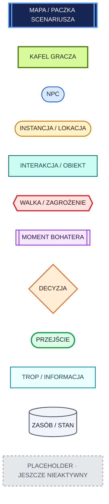

### Typy połączeń

- `A → B` — zwykła kolejność albo odblokowanie;
- `A ⇢ B` — główne przejście między mapami;
- linia przerywana — droga opcjonalna, moment bohatera albo dodatkowy trop;
- podpis na strzałce — warunek, koszt albo skutek przejścia;
- kilka strzałek wchodzących do decyzji nie oznacza, że wszystkie są
  wymagane; wymagania są jawnie podpisane.

### Co na diagramie jest kafelkiem gracza

Zielony węzeł `KAFEL` jest wyborem widocznym w interfejsie i przypisanym do
pola interakcji na planszy. Opisuje cel gracza, nie cały dialog ani techniczną
metodę wykonania. Przykładowo kafelek `Poznaj wersję Marka` może otworzyć
rozmowę z kilkoma pytaniami, próbą przekonania i różnymi reakcjami NPC, ale graf
kampanii nie rozpisuje tych wewnętrznych kroków.

Diagram przybliżenia pokazuje pełną pulę możliwych kafelków. Runtime ma
jednocześnie pokazywać najwyżej siedem działań wraz z czerwonym wyjściem.
Kafelki zakończone znikają, a warunkowe pojawiają się dopiero po spełnieniu
opisanej flagi, odkryciu informacji albo obecności odpowiedniego bohatera.

## Założone uproszczenia względem PDF-u

1. Przygoda jest podzielona na cztery paczki scenariusza, a nie jeden monolit.
2. Siedziba Gildii jest osobną, wielokrotnego użytku Mapą 0. Otwiera kampanię,
   a po finale przyjmuje raport i zapisuje długoterminowe konsekwencje.
3. Podróż do zawalonej drogi jest krótkim montażem i wyborem, nie osobną
   czwartą mapą.
4. Głodne Cienie to jedno stado z przywódcą i morale. Nie trzeba pokonać
   każdej bestii, aby zakończyć encounter.
5. Tłum w strażnicy jest licznikiem paniki/stanu strefy. Fizyczne pionki mają
   tylko Marek, Alven, Salka i ewentualnie jedna grupa cywilów.
6. Osobiste momenty bohaterów są opcjonalne i widoczne tylko wtedy, gdy dany
   bohater znajduje się w drużynie.
7. Żaden obowiązkowy cel nie wymaga konkretnego bohatera. Bohater może dawać
   najlepszą albo tańszą drogę, ale zawsze istnieje alternatywa.
8. Dynamiczna woda w Cysternie jest podzielona na kilka stanów/stref, a nie
   zmienia każdego pola mapy co rundę.
9. Zakłócanie magii przez Rezonans będzie jawną zdolnością z rzutem obronnym
   albo testem koncentracji, nie losowym anulowaniem kart.
10. Każda z czterech skrzyń pyłu ma własny, policzalny stan.

## Tempo pierwszej podróży

Droga z Gildii do zawalonego traktu ma bazowo 60 minut. Wybór tempa jest
decyzją między czasem a przygotowaniem do najbliższej walki, a nie wyłącznie
kosmetycznym mnożnikiem:

| Tempo | Udana nawigacja | Otwarcie walki z Głodnymi Cieniami | Stan dla dalszych map |
| --- | ---: | --- | --- |
| Szybkie | 45 min | bez ostrzeżenia Erynda przeciwnicy mają przewagę do inicjatywy; ostrzeżenie tylko neutralizuje zasadzkę | `travel.arrival.early`, jeśli nie było opóźnienia |
| Normalne | 60 min | domyślnie bez przewagi; ostrzeżenie Erynda daje przewagę drużynie | `travel.arrival.on_time` |
| Wolne | 80 min | drużyna może wykonać Stealth; z ostrzeżeniem Erynda ma również przewagę do inicjatywy | `travel.arrival.late` |

Test Wisdom (Survival) ST 12 rozstrzyga nawigację. Porażka nie blokuje
przygody, ale dodaje 30 minut i ponownie wylicza okno przybycia. Handoff zapisuje
też `travel.total_minutes`, `travel.schedule_delta_minutes`, wynik nawigacji,
modyfikator Pasywnej Percepcji i dostępność skradania. Późniejsze mapy mają
używać okna przybycia do stanu tropów, ocalałych i czasu uzyskanego przez
przeciwników; konkretne gałęzie należy uruchamiać dopiero wraz z ich contentem.

---

# Graf całej przygody

```mermaid
flowchart LR
    START(["START KAMPANII"])

    subgraph ACT0["PACZKA 0 · SIEDZIBA GILDII"]
        GUILD[["MAPA 0 · SIEDZIBA GILDII"]]
        INTRO["Intro narratora"]
        NESSA(["NPC · Nessa Vel"])
        BRIEFING["Obowiązkowa odprawa"]
        QUEST_ACTIVE["Stan · kontrakt aktywny"]
        DEPARTURE(["Brama wyjazdowa"])
        HANDOFF0(["Handoff 00 → 01"])
        GUILD_RETURN[["POWRÓT · MAPA 0"]]
        REPORT(["Raport dla Nessy"])
        ARCHIVE["Archiwum · zapis następstw"]
        EPILOG(["Epilog i konsekwencje kampanii"])
    end

    subgraph ACT1["PACZKA 1 · ZAWALONA DROGA"]
        TRAVEL["Montaż drogi przez zerwane szlaki"]
        ROAD[["MAPA 1 · ZAWALONA DROGA"]]
        TEREN(["Teren · ranny strażnik"])
        WAGON(["Przewrócony wóz i tropy"])
        SHADOWS{{"Głodne Cienie"}}
        ROUTE{"Wybrać drogę do strażnicy"}
        HANDOFF1(["Handoff 01 → 02"])
    end

    subgraph ACT2["PACZKA 2 · CZARNY BRÓD"]
        KEEP[["MAPA 2 · STRAŻNICA CZARNEGO BRODU"]]
        GATE(["Brama i pierwszy kontakt"])
        APPROACH{"Negocjacje, infiltracja czy atak?"}
        MARK(["Marek Venn"])
        ALVEN(["Alven Rost"])
        SALKA(["Salka"])
        KEEP_TRUTH["Prawda o transporcie, chorobie i Raven"]
        DESCENT{"Czy i jak zejść do Cysterny?"}
        HANDOFF2(["Handoff 02 → 03"])
    end

    subgraph ACT3["PACZKA 3 · GŁODNY REZONANS"]
        CISTERN[["MAPA 3 · PODZIEMNA CYSTERNA"]]
        RESONANCE{{"Głodny Rezonans"}}
        VALVES["Trzy zawory i poziom wody"]
        RITUAL["Komora rytualna i pęknięcie"]
        TACTICAL_END{"Jak zakończyć zagrożenie?"}
        DUST_DECISION{"Komu przypadnie szary pył?"}
        HANDOFF3(["Handoff 03 → 00"])
    end

    START ==> GUILD --> INTRO --> NESSA --> BRIEFING --> QUEST_ACTIVE
    QUEST_ACTIVE --> DEPARTURE ==> HANDOFF0 ==> TRAVEL ==> ROAD
    ROAD --> WAGON
    ROAD --> TEREN
    ROAD --> SHADOWS
    WAGON --> ROUTE
    TEREN --> ROUTE
    SHADOWS --> ROUTE
    ROUTE ==> HANDOFF1 ==> KEEP

    KEEP --> GATE --> APPROACH
    APPROACH --> MARK
    APPROACH --> ALVEN
    APPROACH --> SALKA
    MARK --> KEEP_TRUTH
    ALVEN --> KEEP_TRUTH
    SALKA --> KEEP_TRUTH
    KEEP_TRUTH --> DESCENT ==> HANDOFF2 ==> CISTERN

    CISTERN --> RESONANCE
    CISTERN --> VALVES
    CISTERN --> RITUAL
    RESONANCE --> TACTICAL_END
    VALVES --> TACTICAL_END
    RITUAL --> TACTICAL_END
    TACTICAL_END --> DUST_DECISION ==> HANDOFF3 ==> GUILD_RETURN
    GUILD_RETURN --> REPORT --> ARCHIVE --> EPILOG

    classDef map fill:#172554,color:#ffffff,stroke:#60a5fa,stroke-width:3px;
    classDef npc fill:#dbeafe,color:#172554,stroke:#2563eb,stroke-width:2px;
    classDef instance fill:#fef3c7,color:#451a03,stroke:#d97706,stroke-width:2px;
    classDef interaction fill:#ccfbf1,color:#134e4a,stroke:#0f766e,stroke-width:2px;
    classDef combat fill:#fee2e2,color:#450a0a,stroke:#dc2626,stroke-width:3px;
    classDef decision fill:#ffedd5,color:#431407,stroke:#ea580c,stroke-width:2px;
    classDef transition fill:#dcfce7,color:#052e16,stroke:#16a34a,stroke-width:3px;
    classDef clue fill:#ecfeff,color:#164e63,stroke:#0891b2,stroke-width:2px;

    class GUILD,GUILD_RETURN,ROAD,KEEP,CISTERN map;
    class NESSA,TEREN,MARK,ALVEN,SALKA npc;
    class DEPARTURE,GATE instance;
    class INTRO,BRIEFING,TRAVEL,WAGON,VALVES,RITUAL,ARCHIVE interaction;
    class SHADOWS,RESONANCE combat;
    class ROUTE,APPROACH,DESCENT,TACTICAL_END,DUST_DECISION decision;
    class START,HANDOFF0,HANDOFF1,HANDOFF2,HANDOFF3,REPORT,EPILOG transition;
    class QUEST_ACTIVE,KEEP_TRUTH clue;
```

---

# Mapa 0 — Siedziba Gildii

Mapa 0 jest ekranem-bazą w konwencji point-and-click, a nie planem budynku do
swobodnego chodzenia. Ilustracja pokazuje sześć czytelnych miejsc, lecz w
pierwszej wersji mechanicznie działają tylko Nessa i brama wyjazdowa. Pozostałe
obszary rezerwują kompozycję pod przyszły rozwój, ale nie mają jeszcze pól LED,
skanów ani pustych menu.

## Główny przepływ

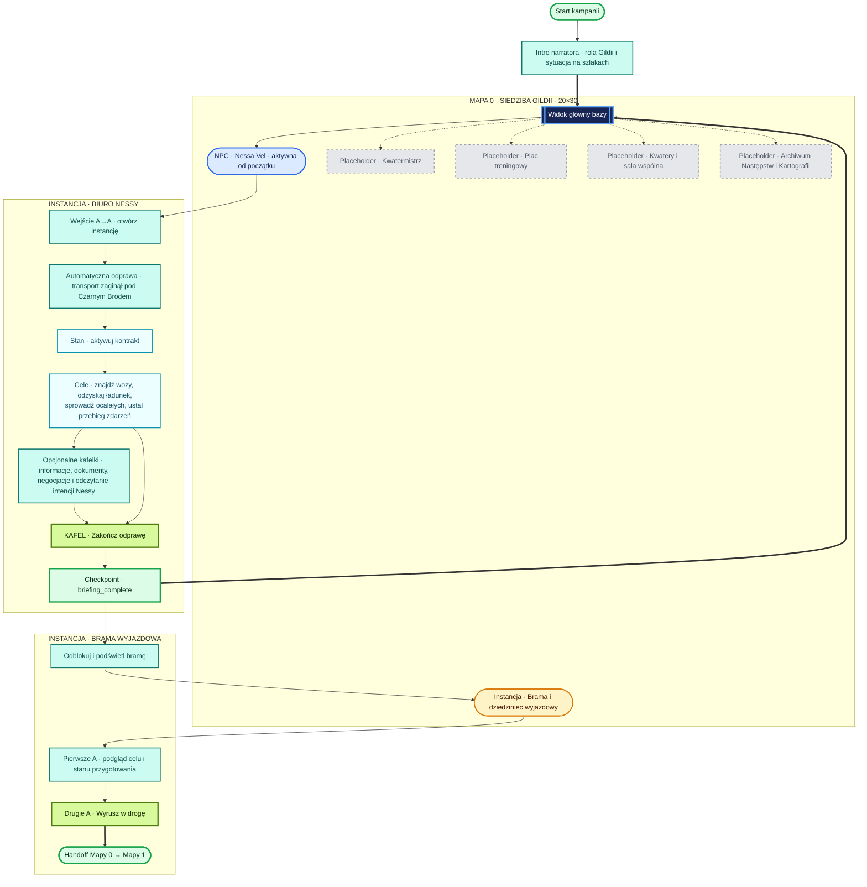

## Przybliżenie: kafelki gracza na Mapie 0

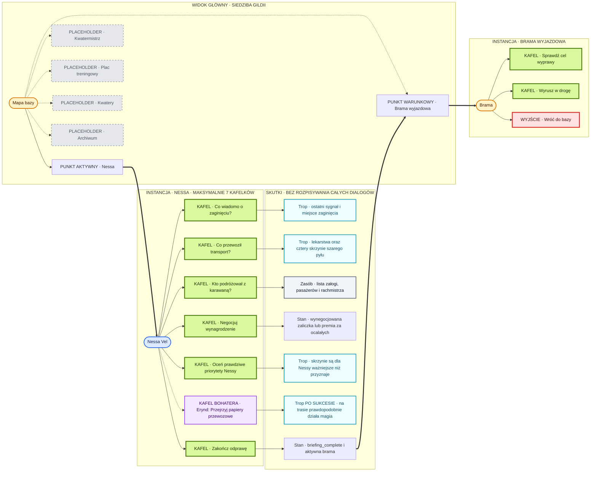

Mapa powinna mieć dwa aktywne znaczniki runtime, ale nie jednocześnie: przed
odprawą pulsuje Nessa, po jej zakończeniu zaczyna pulsować brama. Cztery
placeholdery pozostają elementami ilustracji. Archiwum po przyszłym wdrożeniu
ma prezentować zapis długoterminowych następstw decyzji, odkrytych faktów i
zmian w świecie, a nie być kolejną tablicą zadań.

---

# Mapa 1 — Zawalona Droga

## Główny przepływ

```mermaid
flowchart TB
    subgraph JOURNEY["MONTAŻ PODRÓŻY · BEZ OSOBNEJ MAPY"]
        FROM_GUILD(["Handoff Mapy 0 → Mapy 1"])
        WORLD["Klimat · spalone posterunki, uchodźcy,<br/>obce mundury, drożejąca żywność"]
        ANOMALY["Trop · dźwięk biegnie z niewłaściwego kierunku"]
        ERYND_SIGN["Trop · zwierzęta omijają okolice brodu"]
        NIMRA_SIGN["Trop · nieregularne impulsy magiczne"]
        ARRIVAL(["Przejście · przybycie do wąwozu"])
    end

    subgraph MAP1["MAPA 1 · ZAWALONA DROGA · 20×30"]
        ENTRY(["Instancja · Wejście do wąwozu"])

        WAGON(["Instancja · Przewrócony wóz<br/>osłona i częściowa blokada drogi"])
        SEARCH_WAGON["Interakcja · Przeszukaj wóz"]
        MOVE_WAGON["Interakcja · Przesuń wóz"]
        SALVAGE_WAGON["Interakcja · Rozbierz na materiały"]
        BARRICADE_WAGON["Interakcja · Ustaw barykadę"]
        MANIFEST[("Zasób · manifest transportowy")]
        MEDICINE[("Zasób · ukryta paczka lekarstw")]
        BLOOD["Trop · ślady krwi i puste skrzynki"]

        SLOPE(["Instancja · Zawalona skarpa"])
        CLIMB["Interakcja · Wejdź na wysokość<br/>porażka: ruch lub osunięcie, nie blokada"]

        CULVERT(["Instancja · Stary przepust"])
        FIND_CULVERT["Trop · Znajdź wejście"]
        SNEAK_CULVERT["Interakcja · Przejdź pojedynczo i cicho"]

        TOWER(["Instancja · Wieża sygnałowa"])
        PLATFORM["Interakcja · Wejdź na platformę"]
        BELL["Interakcja · Użyj starego dzwonu"]
        CUT_SUPPORTS["Interakcja · Przetnij podpory"]
        STONE_BARREL["Interakcja · Zepchnij beczkę kamieni"]

        STREAM(["Instancja · Boczne zejście do strumienia<br/>trudny teren i obejście"])
        TRACKS["Trop · świeże ślady ku strażnicy"]

        TEREN(["NPC · Teren<br/>ranny, odwodniony, przerażony"])
        AID_TEREN["Interakcja · Opatrz ranę"]
        WATER_TEREN["Interakcja · Daj wodę lub lekarstwo"]
        QUESTION_TEREN["Interakcja · Uspokój i wypytaj"]
        ORDER_TEREN["Interakcja · Zdecyduj, czy może iść"]
        TEREN_LIE["Trop · wersja Terena jest niepełna"]
        TEREN_TRUTH["Trop · strażnicy chcieli odebrać wodę;<br/>bójka poprzedziła atak zwierząt"]
        SINGING_WELL["Trop · pasterz mówił o „śpiewającej studni”"]

        PACK{{"Encounter · Głodne Cienie<br/>wypaczone, głodne stado"}}
        PACK_CHOICE{"Jak poradzić sobie ze stadem?"}
        FIGHT["Walka · wykorzystaj teren i osłony"]
        FOOD["Interakcja · Odciągnij jedzeniem"]
        FIRE["Interakcja · Odstrasz ogniem"]
        RING_BELL["Interakcja · Użyj dzwonu"]
        BYPASS["Interakcja · Obejdź przepustem lub strumieniem"]
        CALM["Interakcja · Uspokój wiedzą łowiecką lub magią"]
        MORALE["Stan · stado ucieka po utracie przywódcy<br/>albo przełamaniu morale"]
        YOUNG_BEAST{"Decyzja · Co zrobić z młodą bestią?"}
        SPARE["Pozostaw lub ulecz<br/>późniejsza reakcja Salki/uchodźców"]
        KILL["Dobij<br/>późniejsza reakcja Terena/uchodźców"]

        ROUTE_DECISION{"Decyzja · Droga do Czarnego Brodu"}
        MAIN_ROUTE["Główny trakt<br/>szybciej, ale drużynę widać"]
        FOREST_ROUTE["Leśny szlak<br/>wolniej, blisko źródła anomalii"]
        TO_KEEP(["Przejście · handoff do Mapy 2"])
    end

    FROM_GUILD ==> WORLD --> ANOMALY --> ARRIVAL
    WORLD -.-> ERYND_SIGN --> ARRIVAL
    WORLD -.-> NIMRA_SIGN --> ARRIVAL

    ARRIVAL ==> ENTRY
    ENTRY --> WAGON
    ENTRY --> SLOPE
    ENTRY --> CULVERT
    ENTRY --> TOWER
    ENTRY --> STREAM
    ENTRY --> TEREN
    ENTRY --> PACK

    WAGON --> SEARCH_WAGON
    WAGON --> MOVE_WAGON
    WAGON --> SALVAGE_WAGON
    WAGON --> BARRICADE_WAGON
    SEARCH_WAGON --> MANIFEST
    SEARCH_WAGON --> MEDICINE
    SEARCH_WAGON --> BLOOD

    SLOPE --> CLIMB
    CULVERT --> FIND_CULVERT --> SNEAK_CULVERT
    TOWER --> PLATFORM
    TOWER --> BELL
    TOWER --> CUT_SUPPORTS
    TOWER --> STONE_BARREL
    STREAM --> TRACKS

    TEREN --> AID_TEREN
    TEREN --> WATER_TEREN
    TEREN --> QUESTION_TEREN
    TEREN --> ORDER_TEREN
    QUESTION_TEREN --> TEREN_LIE
    QUESTION_TEREN -->|zaufanie lub cierpliwość| TEREN_TRUTH
    QUESTION_TEREN --> SINGING_WELL

    PACK --> PACK_CHOICE
    PACK_CHOICE --> FIGHT --> MORALE
    PACK_CHOICE --> FOOD --> MORALE
    PACK_CHOICE --> FIRE --> MORALE
    PACK_CHOICE --> RING_BELL --> MORALE
    PACK_CHOICE --> BYPASS
    PACK_CHOICE --> CALM --> MORALE
    BELL -.-> RING_BELL
    SNEAK_CULVERT -.-> BYPASS
    STREAM -.-> BYPASS
    MORALE --> YOUNG_BEAST
    YOUNG_BEAST --> SPARE
    YOUNG_BEAST --> KILL

    MANIFEST --> ROUTE_DECISION
    TEREN_LIE --> ROUTE_DECISION
    TEREN_TRUTH --> ROUTE_DECISION
    TRACKS --> ROUTE_DECISION
    BYPASS --> ROUTE_DECISION
    SPARE --> ROUTE_DECISION
    KILL --> ROUTE_DECISION
    ROUTE_DECISION --> MAIN_ROUTE --> TO_KEEP
    ROUTE_DECISION --> FOREST_ROUTE --> TO_KEEP

    classDef npc fill:#dbeafe,color:#172554,stroke:#2563eb,stroke-width:2px;
    classDef instance fill:#fef3c7,color:#451a03,stroke:#d97706,stroke-width:2px;
    classDef interaction fill:#ccfbf1,color:#134e4a,stroke:#0f766e,stroke-width:2px;
    classDef combat fill:#fee2e2,color:#450a0a,stroke:#dc2626,stroke-width:3px;
    classDef decision fill:#ffedd5,color:#431407,stroke:#ea580c,stroke-width:2px;
    classDef transition fill:#dcfce7,color:#052e16,stroke:#16a34a,stroke-width:3px;
    classDef clue fill:#ecfeff,color:#164e63,stroke:#0891b2,stroke-width:2px;
    classDef resource fill:#f1f5f9,color:#0f172a,stroke:#475569,stroke-width:2px;

    class TEREN npc;
    class ENTRY,WAGON,SLOPE,CULVERT,TOWER,STREAM instance;
    class WORLD,ANOMALY,SEARCH_WAGON,MOVE_WAGON,SALVAGE_WAGON,BARRICADE_WAGON,CLIMB,FIND_CULVERT,SNEAK_CULVERT,PLATFORM,BELL,CUT_SUPPORTS,STONE_BARREL,AID_TEREN,WATER_TEREN,QUESTION_TEREN,ORDER_TEREN,FIGHT,FOOD,FIRE,RING_BELL,BYPASS,CALM,MAIN_ROUTE,FOREST_ROUTE,SPARE,KILL interaction;
    class PACK combat;
    class PACK_CHOICE,YOUNG_BEAST,ROUTE_DECISION decision;
    class FROM_GUILD,ARRIVAL,TO_KEEP transition;
    class ERYND_SIGN,NIMRA_SIGN,BLOOD,TRACKS,TEREN_LIE,TEREN_TRUTH,SINGING_WELL clue;
    class MANIFEST,MEDICINE,MORALE resource;
```

## Przybliżenie: kafelki gracza na Mapie 1

Diagram pokazuje pulę kafelków, a nie wszystkie kafelki jednocześnie. Etykieta
`warunkowy` oznacza, że kafelek pojawia się dopiero po odkryciu odpowiedniego
tropu, zmianie stanu albo wejściu wskazanego bohatera do drużyny.

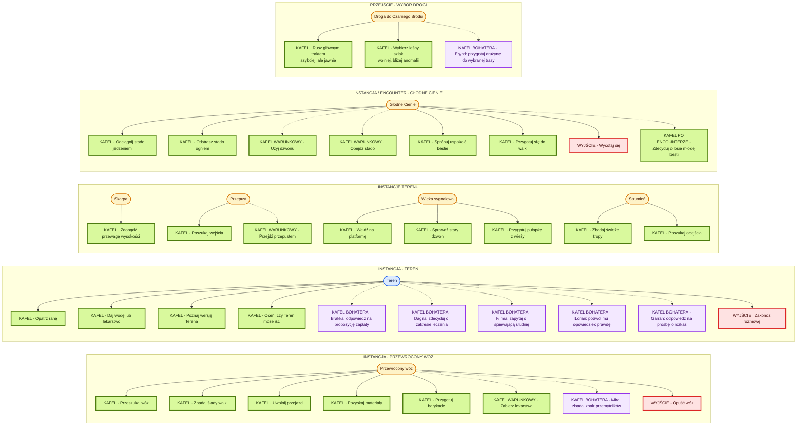

Uwaga dla instancji Terena: pełna pula jest większa niż siedem. Kafelki
leczenia i podstawowej rozmowy znikają po rozstrzygnięciu, a kafelki bohaterów
pojawiają się tylko dla obecnego składu. Jeżeli mimo tego aktywnych byłoby więcej
niż sześć działań, momenty bohaterów należy pokazywać kolejno po zmianie stanu
Terena, nie stronicować menu.

## Opcjonalne momenty siedmiu bohaterów na Mapie 1

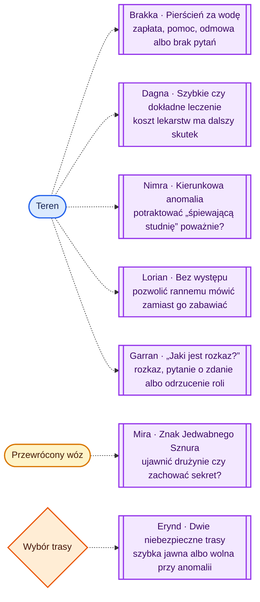

### Stan przekazywany z Mapy 1

- przyjęty kontrakt, zaliczka i warunki premii;
- manifest oraz wiedza o prawdziwej wartości transportu;
- paczka lekarstw: znaleziona, zabrana, zużyta lub pozostawiona;
- Teren: stan rany, pragnienie, zdolność do drogi, zaufanie i ujawniona prawda;
- stan przewróconego wozu i zabrane materiały;
- rozwiązanie spotkania ze stadem i los młodej bestii;
- wybrana trasa, hałas, opóźnienie oraz rozpoznanie anomalii;
- aktywowane momenty osobiste i ujawnione informacje;
- aktualne PW, zasoby kart, ekwipunek, warunki i czas drużyny.

---

# Mapa 2 — Strażnica Czarnego Brodu

## Główny przepływ

```mermaid
flowchart TB
    ARRIVE(["Przejście · przybycie pod strażnicę<br/>warunki zależą od trasy, czasu i hałasu"])

    subgraph CONTACT["PIERWSZY KONTAKT"]
        GATE(["Instancja · Zewnętrzna brama<br/>wóz-barykada, brona, łucznicy na wieży"])
        OBSERVE["Trop · Obrońcy nie chcą walczyć,<br/>ale odpowiedzą na siłowe wejście"]
        ENTRY_CHOICE{"Decyzja · Jak wejść?"}

        TALK["Droga · Negocjacje przez bramę"]
        PEACE_COST{"Warunek pokoju<br/>rozmowa, kontrakt, pomoc chorym<br/>lub czasowe zabezpieczenie broni"}

        INFILTRATE["Droga · Infiltracja"]
        STABLE_ENTRY["Wejście · przez stajnię"]
        DRAIN_ENTRY["Wejście · kanałem odpływowym"]
        ROOF_ENTRY["Wejście · po dachu lub murze"]
        WALL_ENTRY["Wejście · uszkodzonym fragmentem muru"]
        DETECTED{"Czy infiltracja została wykryta?"}

        ASSAULT{{"Encounter opcjonalny · Siłowe wejście<br/>łucznicy, barykady, cywile i ryzyko pożaru"}}
        TRUCE["Interakcja · Rozejm podczas walki<br/>możliwy, gdy zagrożeni są cywile"]
    end

    subgraph COURTYARD["DZIEDZINIEC I INSTANCJE STRAŻNICY"]
        YARD(["Instancja · Dziedziniec<br/>studnia, wozy, legowiska, zwierzęta"])
        PANIC[("Stan · Panika cywilów")]
        WELL["Interakcja · Zbadaj studnię"]
        WELL_SOUND["Trop · metal wywołuje cichy śpiew"]
        WELL_NATURE["Trop · zwierzęta unikają wody"]
        WELL_RESIDUE["Trop · srebrzysty osad na linie"]
        WELL_SOURCE["Wniosek · skażenie pochodzi z podziemi"]

        CUSTOMS(["Instancja · Dawna izba celna"])
        MARK(["NPC · Marek Venn<br/>były sierżant i dowódca obrońców"])
        MARK_ACCOUNT["Informacja · lekarstwa zabrano chorym;<br/>transport przejęto po bójce"]

        STABLE(["Instancja · Stajnia"])
        ALVEN(["NPC · Alven Rost<br/>ranny rachmistrz, nie więzień"])
        ALVEN_ACCOUNT["Informacja · transport publiczny<br/>nie może być przejmowany przez każdą osadę"]

        INFIRMARY(["Instancja · Prowizoryczna lecznica"])
        SALKA(["NPC · Salka<br/>utalentowana, wyczerpana medyczka"])
        SICK_CHILD(["NPC/punkt · Chory chłopiec<br/>„Ktoś śpiewa pod wodą”"])
        DISEASE["Trop · gorączka, ciemne żyły,<br/>halucynacje i magiczne skurcze"]

        WAREHOUSE(["Instancja · Magazyn"])
        DUST_TWO[("Zasób · dwie skrzynie szarego pyłu")]
        FOOD_STOCK[("Zasób · część żywności")]
        RECORDS["Trop · dokumenty transportowe"]
        RAVEN_RESERVE["Informacja · Raven ma małą rezerwę;<br/>brak pyłu oznacza racjonowanie, nie natychmiastowy upadek"]

        MED_WAGON(["Instancja · Wóz z lekarstwami"])
        BROKEN_LOCK["Trop · zamek otwarto fachowo,<br/>ale celowo zostawiono część zapasów"]

        KITCHEN(["Instancja · Kuchnia"])
        RATIONS[("Stan · malejące racje żywności")]
        UNFAIR_RATIONS["Trop · dezerterzy dostają więcej niż cywile"]

        STAIRS(["Instancja · Zabarykadowane schody do Cysterny"])
        OLD_MINER(["NPC · Stary kopacz"])
        STONE_PLATE["Trop · śpiew zaczął się po usunięciu kamiennej płyty"]
    end

    subgraph TRUTH["USTALENIE PRAWDY I DROGA DO FINAŁU"]
        CONFLICT_TRUTH["Prawda · obie strony mają częściowo rację"]
        DUST_BELOW["Prawda · dwie skrzynie przeniesiono do Cysterny;<br/>jedna została otwarta"]
        FAILED_CLEANSE["Prawda · pył ograniczył skażenie,<br/>ale pobudził istotę pod strażnicą"]
        ACCESS{"Decyzja · Jak uzyskać dostęp do Cysterny?"}
        COOPERATE["Współpraca z Markiem, Salką lub Alvenem"]
        OPEN_STAIRS["Usuń barykadę i zabezpiecz zejście"]
        FORCE_DESCENT["Zejście bez zgody<br/>większa panika i gorszy handoff"]
        TO_CISTERN(["Przejście · handoff do Mapy 3"])
    end

    ARRIVE ==> GATE --> OBSERVE --> ENTRY_CHOICE
    ENTRY_CHOICE --> TALK --> PEACE_COST --> YARD
    ENTRY_CHOICE --> INFILTRATE
    INFILTRATE --> STABLE_ENTRY --> DETECTED
    INFILTRATE --> DRAIN_ENTRY --> DETECTED
    INFILTRATE --> ROOF_ENTRY --> DETECTED
    INFILTRATE --> WALL_ENTRY --> DETECTED
    DETECTED -->|nie| YARD
    DETECTED -->|tak| PANIC
    PANIC -->|wysoka panika lub agresja| ASSAULT
    ENTRY_CHOICE --> ASSAULT
    ASSAULT -.-> TRUCE --> YARD
    ASSAULT -->|przełamanie obrony| YARD

    YARD --> WELL
    YARD --> CUSTOMS
    YARD --> STABLE
    YARD --> INFIRMARY
    YARD --> WAREHOUSE
    YARD --> MED_WAGON
    YARD --> KITCHEN
    YARD --> STAIRS

    WELL --> WELL_SOUND
    WELL --> WELL_NATURE
    WELL --> WELL_RESIDUE
    WELL_SOUND --> WELL_SOURCE
    WELL_NATURE --> WELL_SOURCE
    WELL_RESIDUE --> WELL_SOURCE

    CUSTOMS --> MARK --> MARK_ACCOUNT
    STABLE --> ALVEN --> ALVEN_ACCOUNT
    INFIRMARY --> SALKA
    INFIRMARY --> SICK_CHILD
    INFIRMARY --> DISEASE
    WAREHOUSE --> DUST_TWO
    WAREHOUSE --> FOOD_STOCK
    WAREHOUSE --> RECORDS --> RAVEN_RESERVE
    MED_WAGON --> BROKEN_LOCK
    KITCHEN --> RATIONS
    KITCHEN --> UNFAIR_RATIONS
    STAIRS --> OLD_MINER --> STONE_PLATE

    MARK_ACCOUNT --> CONFLICT_TRUTH
    ALVEN_ACCOUNT --> CONFLICT_TRUTH
    RAVEN_RESERVE --> CONFLICT_TRUTH
    WELL_SOURCE --> DUST_BELOW
    STONE_PLATE --> DUST_BELOW
    DUST_TWO --> DUST_BELOW
    DUST_BELOW --> FAILED_CLEANSE --> ACCESS
    CONFLICT_TRUTH --> ACCESS
    ACCESS --> COOPERATE --> OPEN_STAIRS --> TO_CISTERN
    ACCESS --> FORCE_DESCENT --> TO_CISTERN

    classDef npc fill:#dbeafe,color:#172554,stroke:#2563eb,stroke-width:2px;
    classDef instance fill:#fef3c7,color:#451a03,stroke:#d97706,stroke-width:2px;
    classDef interaction fill:#ccfbf1,color:#134e4a,stroke:#0f766e,stroke-width:2px;
    classDef combat fill:#fee2e2,color:#450a0a,stroke:#dc2626,stroke-width:3px;
    classDef decision fill:#ffedd5,color:#431407,stroke:#ea580c,stroke-width:2px;
    classDef transition fill:#dcfce7,color:#052e16,stroke:#16a34a,stroke-width:3px;
    classDef clue fill:#ecfeff,color:#164e63,stroke:#0891b2,stroke-width:2px;
    classDef resource fill:#f1f5f9,color:#0f172a,stroke:#475569,stroke-width:2px;

    class MARK,ALVEN,SALKA,SICK_CHILD,OLD_MINER npc;
    class GATE,YARD,CUSTOMS,STABLE,INFIRMARY,WAREHOUSE,MED_WAGON,KITCHEN,STAIRS instance;
    class OBSERVE,TALK,PEACE_COST,INFILTRATE,STABLE_ENTRY,DRAIN_ENTRY,ROOF_ENTRY,WALL_ENTRY,TRUCE,WELL,COOPERATE,OPEN_STAIRS,FORCE_DESCENT interaction;
    class ASSAULT combat;
    class ENTRY_CHOICE,DETECTED,ACCESS decision;
    class ARRIVE,TO_CISTERN transition;
    class WELL_SOUND,WELL_NATURE,WELL_RESIDUE,WELL_SOURCE,MARK_ACCOUNT,ALVEN_ACCOUNT,DISEASE,RECORDS,RAVEN_RESERVE,BROKEN_LOCK,UNFAIR_RATIONS,STONE_PLATE,CONFLICT_TRUTH,DUST_BELOW,FAILED_CLEANSE clue;
    class PANIC,DUST_TWO,FOOD_STOCK,RATIONS resource;
```

## Przybliżenie: kafelki gracza na Mapie 2

Kafelki rozmowy pokazują cel rozmowy, nie gotowe kwestie dialogowe. Po wybraniu
`Poznaj wersję Marka` gracz nadal opisuje pytania i argumenty, a flow NPC
kontroluje informacje, testy, próby i konsekwencje.

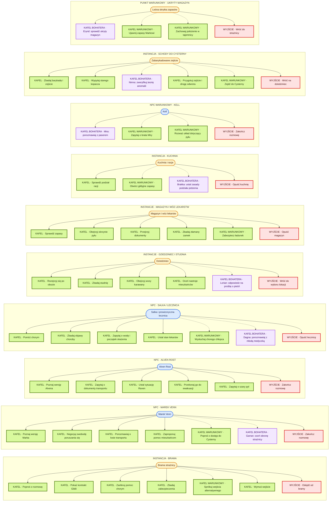

## Opcjonalne momenty siedmiu bohaterów na Mapie 2

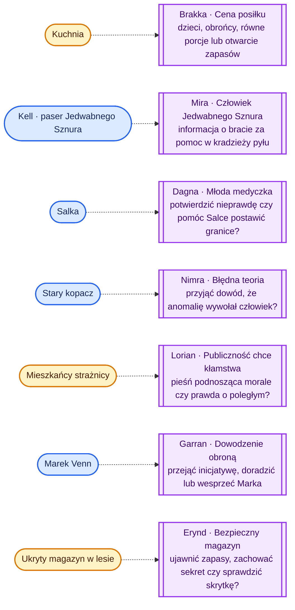

### Stan przekazywany z Mapy 2

- droga wejścia: pokojowa, skryta, wykryta albo siłowa;
- nastawienie Marka, Alvena, Salki, obrońców i cywilów;
- poziom paniki, ofiary, pożar i stan bramy;
- poznana wersja wydarzeń i wiedza o rezerwach Raven;
- stan lekarstw, żywności oraz ukrytych zapasów;
- cztery instancje skrzyń: dwie w magazynie, jedna zamknięta w Cysternie,
  jedna otwarta i częściowo rozsypana;
- wiedza o płycie, studni, anomalii i nieudanej próbie oczyszczenia;
- osoby schodzące do Cysterny oraz przygotowane liny, narzędzia, ładunki i
  drogi odwrotu;
- aktualne PW, zasoby, warunki, ekwipunek oraz czas drużyny.

---

# Mapa 3 — Podziemna Cysterna

## Główny przepływ

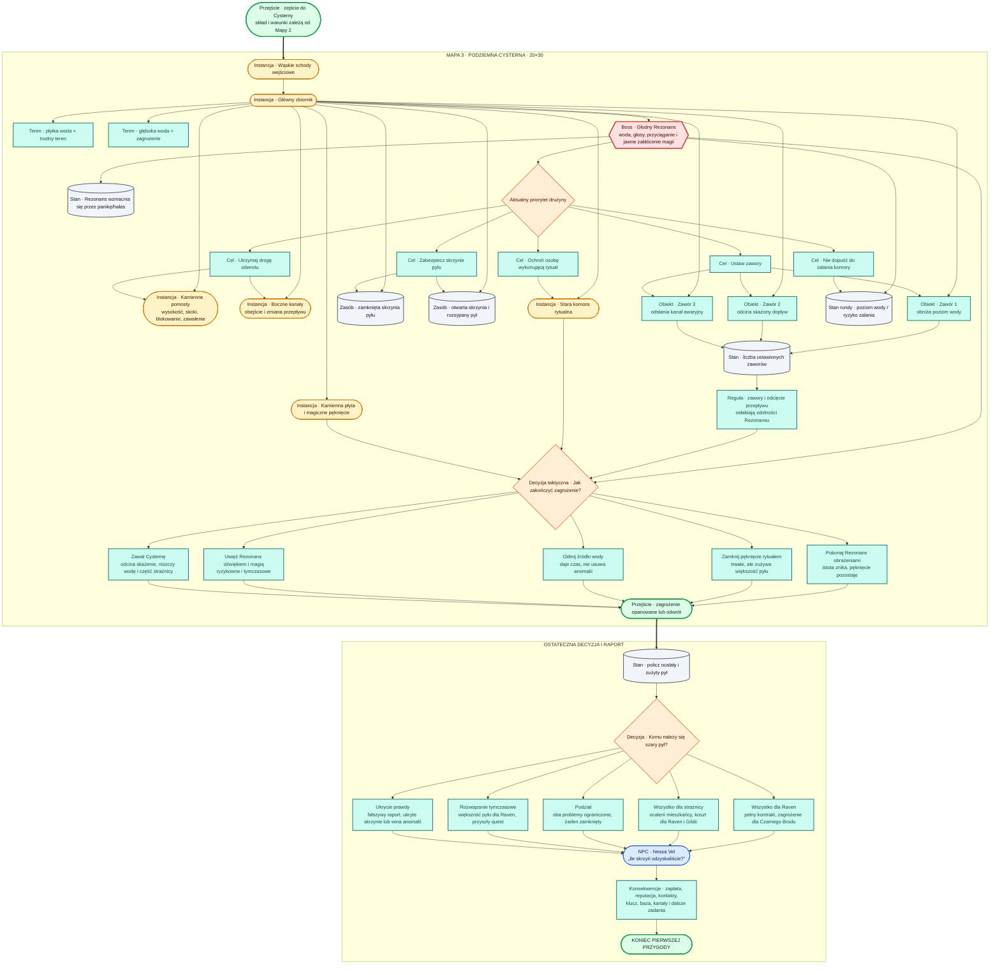

## Przybliżenie: kafelki gracza na Mapie 3

W Cysternie część kafelków jest eksploracyjna, a część pojawia się jako
kontekstowa akcja pola podczas encountera. Z punktu widzenia gracza oba typy są
decyzją wybraną na planszy; różni je koszt czasu walki i stan tury.

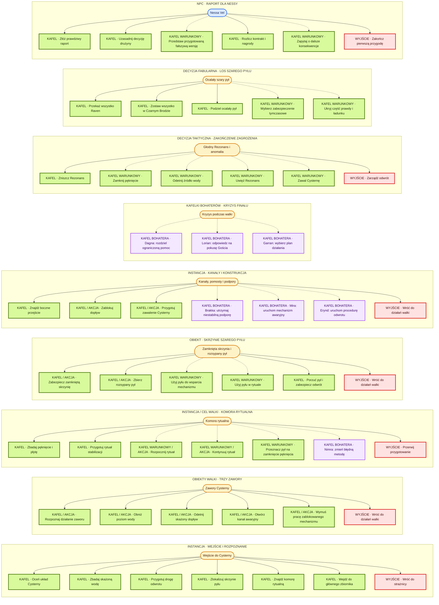

Kafelki `Zniszcz Rezonans`, `Zamknij pęknięcie` itd. nie zastępują kart
bojowych. Wskazują aktualny cel taktyczny i odblokowują odpowiednie obiekty lub
akcje pola. Zwykłe ataki, czary i cechy nadal są wybierane kartami postaci oraz
kontekstowym menu planszy.

## Opcjonalne momenty siedmiu bohaterów na Mapie 3

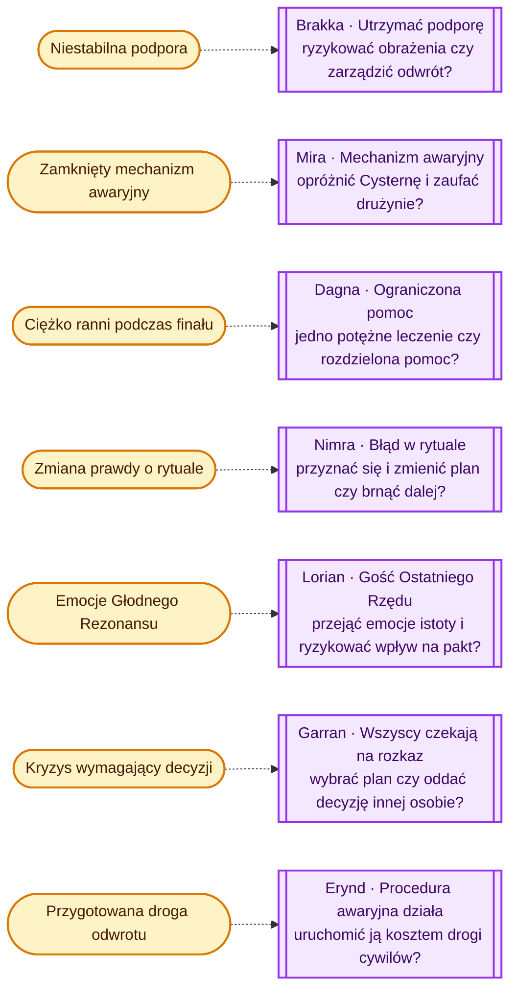

---

# Model najważniejszego stanu przygody

Ten diagram nie pokazuje kolejności scen. Pokazuje, które stany wpływają na
finał i nie mogą pozostać wyłącznie narracją LLM.

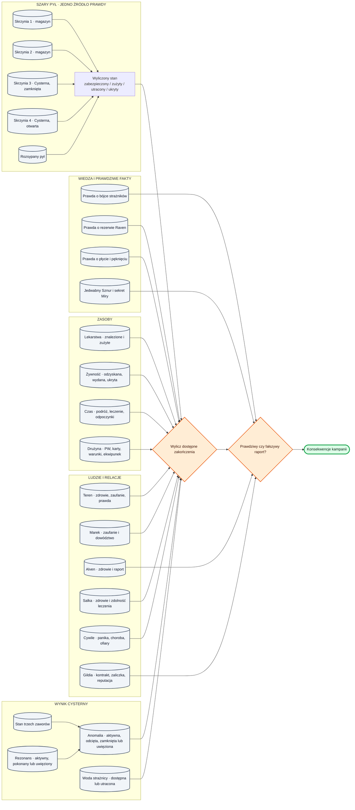

---

# Mapowanie grafu na pliki contentu

| Element grafu | Docelowe miejsce w paczce |
|---|---|
| Mapa/paczka | `scenario.json`, `environment.json`, `print_maps.json` |
| Kafelek gracza | player-facing `goal` oraz przejście w `flows.json`; najwyżej sześć kafelków i czerwone wyjście naraz |
| Instancja/lokacja | `exploration/zones.json` albo `exploration/points.json` |
| NPC | `actors.json`, definicja punktu, `npc_transitions.json`, `flows.json` |
| Interakcja/cel | `challenges.json`, cel punktu/NPC albo polityka fixture'a |
| Trop/informacja | `observations.json`, ujawniana informacja NPC albo efekt flagowy |
| Obiekt/fixture | zasób/fixture w eksploracji albo `scene_object` encountera |
| Walka | `exploration/encounter_triggers.json` i osobny plik/paczka encountera |
| Moment bohatera | warunkowy cel wymagający odpowiedniego `actor_id` w drużynie |
| Decyzja | węzeł i przejścia `flows.json` oraz deterministyczne efekty |
| Przejście map | continuation i jawna lista propagowanych flag/efektów |
| Zasób/stan | item questowy, zasób eksploracji, stan NPC albo flaga sceny |

## Elementy oznaczone do późniejszego doprecyzowania

- statblock oraz dokładny wygląd Głodnego Rezonansu;
- liczba i statblocki Głodnych Cieni dla drużyn 3-, 4- i 5-osobowych;
- konkretne progi trudności testów;
- reguła morale stada oraz obrońców;
- kontrakt wielorundowego rytuału i zdarzeń `round_started`;
- dokładne warunki pięciu zakończeń;
- skutki osobistych momentów bohaterów;
- sposób przekazania prywatnej informacji Mirze przy wspólnym ekranie;
- finalne pozycje wszystkich pól, stref, fixture'ów i interaction padów.
